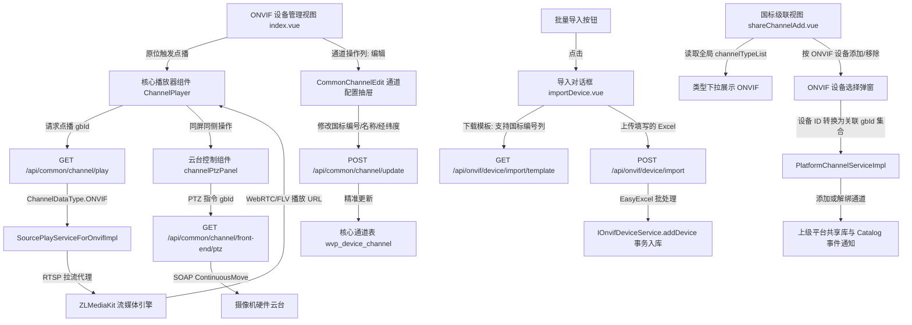

<!-- doc/reaticle_docs/debug/onvif-debug-optimization-plan.md -->

# ONVIF 接入调试问题深度解析与更新方案

本文档基于 `doc/reaticle_docs/onvif-implementation/phase-4-restful-api-and-web-ui.md` 规范及现场人工联调反馈，针对发现的点播报错跳转、云台遮挡画面、模板批量导入缺失、ONVIF 国标编号配置与同步断链、以及国标级联无 ONVIF 选项等关键问题进行系统解构，制定确定性架构升级方案。

---

## 1 Objectives (核心目标)

1. **重构点播与云台控制交互链路**：
   - 根治点击“点播”跳转至 `/live` 并抛出 `TypeError: Cannot read properties of undefined (reading 'data')` 的问题；
   - 摒弃离开当前视图的路由跳转方式，改用原位弹窗模态播放器；
   - 将“播放/点播”与“云台控制”统合至操作列，实现视频画面同屏实时交互操控，杜绝打开侧拉抽屉导致画面中断关闭的问题。
2. **构建标准模板批量导入体系**：
   - 制定 ONVIF 摄像机设备 Excel/CSV 批量录入标准数据结构与模板规范，支持设置设备基本信息及可选的自定义国标编号/行政区划；
   - 交付前端一键下载模板、拖拽解析上传与后端异步排队纳管能力，与局域网 WS-Discovery 探测形成互补。
3. **建立 ONVIF 通道国标属性配置与全生命周期精准同步体系**：
   - 在前端 ONVIF 通道列表补充“编辑”能力，支持直接维护与自定义 20 位国标编码（`gbDeviceId`）、通道名称（`gbName`）、行政区划（`civilCode`）及经纬度等，无缝复用 `CommonChannelEdit.vue`；
   - 彻底重构后端通道同步（`syncChannels`）与删除（`deleteDevice`）绑定机制，由脆弱的 `gbDeviceId` 匹配改为基于 `(data_type=4, data_device_id)` 复合物理主键定位，杜绝因修改国标编号导致的幽灵通道（重复插入）与注销遗留残留。
4. **打通国标级联（GB/T 28181 Cascade）全链路**：
   - 修复前端全局通道类型枚举缺漏，使全局通道管理、级联通道库、录像计划及分组管理中均能准确识别与筛选 ONVIF 设备通道；
   - 扩展级联平台的“按设备添加”与“按设备移除”能力，支持按 ONVIF 物理设备直接将其所有码流通道批量注入或撤销上级平台共享库。

---

## 2 Constraints & Boundary Contract Matrix (约束条件与边界契约矩阵)

### 2.1 缺陷根因深度剖析

| 缺陷表现 | 物理发生位置 | 根因机理剖析 |
| :--- | :--- | :--- |
| **点播跳转报错** `TypeError: reading 'data'` | `views/onvif/index.vue:handlePlay` -> `views/live/index.vue` | 1. 视图层调用了 `$router.push('/live?channelId=' + channel.gbDeviceId)` 强行切出当前页面；<br>2. `/live` 路由中接收并调用 `commonChanel/playChannel`，底层调用 `/api/common/channel/play?channelId=`，该接口要求传入的是核心库自增整数主键 `CommonGBChannel.gbId`，而前端传入的是 20 位国标编码字符串（如 `3402000000132...`），导致后端反序列化或主键查询不到抛出异常，前端拦截器响应解构触发 `data` 未定义错误。 |
| **云台控制关闭画面** | `views/onvif/index.vue:handlePtz` 与 `ptzController.vue` | 目前云台使用独立抽屉（`el-drawer`），内部无播放器组件；且主台账与播放器未形成同屏状态共享，用户点击云台时若已有弹窗播放器则会被遮挡或焦点丢失。 |
| **国标编号不可修改与同步幽灵通道** | `views/onvif/index.vue` 与 `OnvifDeviceServiceImpl.java:syncChannels` | 1. **前端配置断链**：Profile 展开列表中仅纯文本显示 `gbDeviceId`，无编辑通道属性入口；<br>2. **后端生成硬编码**：后端固定生成 `3402000000132%03d%04d`，无法根据现场分配的国标号表自定义；<br>3. **同步定位脆弱**：`syncChannels` 与 `deleteDevice` 均通过 `queryByDeviceId(channel.getGbDeviceId())` 查重/删除。若用户通过通道管理修改了国标号，重新同步时旧编号命中不到将再次执行 `add` 产生重复幽灵通道，删除时亦残留僵尸通道。 |
| **国标级联无 ONVIF 选项与按设备映射失效** | `web/src/main.js:Vue.prototype.$channelTypeList` 与 `shareChannelAdd.vue` | 1. 全局配置中仅定义了 `1:国标设备, 2:推流设备, 3:拉流代理, 200:部标设备`，缺失 `4: ONVIF`，导致级联通道下拉列表无 ONVIF，且在“全局通道管理”表格中渲染样式触发未捕获异常；<br>2. “按设备添加/移除”依赖 `CommonGBChannelMapper.queryByGbDeviceIdsForIds`，该 SQL 针对 `data_device_id in (deviceIds)`，但 ONVIF 的 `data_device_id` 对应的是 `wvp_onvif_channel.id` 而非 `wvp_onvif_device.id`，导致按设备操作完全查不到对应通道。 |

### 2.2 边界契约矩阵 (Boundary Contract Matrix)

```
+---------------------------------------------------------------------------------------------------+
|                                  WVP 核心对象标识符与交互协议契约                                   |
+---------------------+-------------------+------------------------+--------------------------------+
| 对象类型             | 字段名称          | 数据格式               | 语义契约与传递范围              |
+---------------------+-------------------+------------------------+--------------------------------+
| ONVIF 设备主键       | OnvifDevice.id    | Integer (自增主键)     | `wvp_onvif_device.id` 物理主键  |
| ONVIF 通道扩展主键   | OnvifChannel.id   | Integer (自增主键)     | `wvp_onvif_channel.id` 内部主键|
| WVP 核心通道主键     | CommonGBChannel   | Integer (gbId)         | `wvp_device_channel.id`，点播与|
|                     | .gbId             |                        | 云台 API 唯一合法参数           |
| 国标 20 位物理/虚拟码| gbDeviceId        | String(20)             | 上级级联信令、SIP 通信识别码    |
| 通道数据类型标识     | ChannelDataType   | Integer = 4            | 系统常量，标识为 ONVIF 类型     |
| 核心通道绑定外键     | dataDeviceId      | Integer                | 恒等于 `wvp_onvif_channel.id`  |
| RTSP 流媒体契约     | rtspUrl           | URI (带转义认证凭据)   | ZLMediaKit `addStreamProxy` 参数 |
+---------------------+-------------------+------------------------+--------------------------------+
```

1. **核心 API 契约**：
   - 点播拉流：`GET /api/common/channel/play?channelId={gbId}`（必选 `gbId`，类型 `Integer`）；
   - 云台操控：`GET /api/common/channel/front-end/ptz?channelId={gbId}&command={cmd}&panSpeed={ps}&tiltSpeed={ts}&zoomSpeed={zs}`（必选 `gbId`）；
   - 国标通道更新：`POST /api/common/channel/update`（必传 `gbId`，全字段增量差分更新）；
2. **SQL 映射与别名防遮蔽契约**：
   - `OnvifChannelMapper.selectByDeviceId` 关联查询时，必须显式重命名，**严禁** `SELECT oc.*, dc.*` 导致 `dc.id` 覆盖 `oc.id`：
     ```sql
     SELECT 
         oc.*, 
         dc.id AS gb_id, 
         COALESCE(dc.gb_device_id, oc.gb_device_id) AS gb_device_id,
         COALESCE(dc.gb_name, oc.name) AS name
     FROM wvp_onvif_channel oc
     LEFT JOIN wvp_device_channel dc 
         ON dc.data_type = 4 AND dc.data_device_id = oc.id
     WHERE oc.device_id = #{deviceId}
     ORDER BY oc.channel_index ASC, oc.id ASC
     ```

---

## 3 Architecture (架构与模块分解)

### 3.1 总体逻辑流架构



### 3.2 模块分解设计

#### 3.2.1 模块 A：点播原位弹窗与云台同屏融合 (Web UI & Controller)
- **前端重构 (`web/src/views/onvif/index.vue`)**：
  - 引入通用设备播放器组件 `@/views/channel/player.vue` (`ChannelPlayer`)；
  - 移除原 `handlePlay` 中的 `$router.push('/live')` 逻辑；
  - 在主表格“操作”列补充“播放”按钮（若存在通道，直接点播第 1 镜头/主码流）；
  - 在 Profile 展开行“操作”列保留“播放”按钮；点播时将 `channel.gbId` 与 `streamInfo` 传递至 `ChannelPlayer` 原位打开；
  - 移除孤立的右侧抽屉 `ptzDrawerVisible` 与 `ptzController.vue`；点播弹窗自身内嵌 `channelPtzPanel`，视控同屏响应。
- **通道国标属性维护与编辑通道抽屉**：
  - 在 Profile 展开行操作列新增“编辑”按钮；
  - 引入 `@/views/common/CommonChannelEdit.vue` 弹窗/抽屉组件，传入当前通道的 `gbId`，支持管理员自定义通道国标编号（`gbDeviceId`）、名称（`gbName`）、行政区划（`civilCode`）、经纬度及云台类型等字段，保存后无缝触发列表刷新。
- **后端模型补全与 DAO 增强 (`OnvifChannel.java` & `OnvifChannelMapper.java`)**：
  - `OnvifChannel` 增加 `private Integer gbId` 属性及 Swagger 注解；
  - 改造 `selectByDeviceId` SQL，LEFT JOIN `wvp_device_channel` 获取 `dc.id AS gb_id`，并优先合并显示 `dc.gb_device_id` 与 `dc.gb_name`；
  - 新增 `updateGbDeviceId(Integer channelId, String gbDeviceId)` 接口，当核心国标通道变更时保障从表同步。
- **后端同步与删除逻辑健壮性改造 (`OnvifDeviceServiceImpl.java`)**：
  - **同步逻辑**：废弃 `queryByDeviceId(channel.getGbDeviceId())` 查重方式，改为基于 `dataType = 4` 且 `dataDeviceId = channel.getId()` 精准检索。若存在直接更新 `CommonGBChannel`，若不存在则初始化新增，防止修改国标编码后产生重复幽灵通道；
  - **删除逻辑**：废弃按国标编号删除，改为精确查询 `dataType = 4` 且 `dataDeviceId IN (channelIds)` 关联的 `gbId` 执行下线与级联注销，保证数据零残留。

#### 3.2.2 模块 B：标准 Excel 批量导入组件与后端流引擎 (Batch Import Pipeline)
- **模板结构设计 (`OnvifDeviceImportDto.java`)**：
  - 列 1：`设备名称`（必填，如“西门枪机 01”）
  - 列 2：`IP 地址`（必填，如“192.168.1.108”）
  - 列 3：`服务端口`（非必填，缺省 80）
  - 列 4：`用户名`（必填，如“admin”）
  - 列 5：`密码`（必填，如“admin123”）
  - 列 6：`流媒体节点ID`（非必填，缺省使用默认节点）
  - 列 7：`主通道国标编号`（非必填，20位，若为空系统按区划规则生成）
  - 列 8：`行政区划编码`（非必填，如“34020000”）
- **接口与服务设计**：
  - `GET /api/onvif/device/import/template`：基于 EasyExcel 动态生成标准 xlsx 模版文件流；并在 `web/public/static/file/` 预置静态文件作为容灾备份；
  - `POST /api/onvif/device/import`：接收 `MultipartFile`，基于 EasyExcel 监听器批量解析、参数合法性校验、并发安全探测纳管，支持读取用户指定的自定义国标编号并赋给首个 Profile 通道；
  - `POST /api/onvif/device/update`：补全 ONVIF 设备自身基础信息的修改接口（设备重命名、IP/端口修改、密码变更重新校准时钟与握手）。
- **交互视图设计 (`web/src/views/onvif/dialog/importDevice.vue`)**：
  - 放置于主界面顶部工具栏（“批量导入”）；包含模板下载超链接、文件拖拽上传区、导入进度与异常日志清单。

#### 3.2.3 模块 C：国标级联全链路支持 (GB28181 Cascade Integration)
- **前端全局类型注册 (`web/src/main.js`)**：
  - 在 `Vue.prototype.$channelTypeList` 中追加：
    ```javascript
    4: { id: 4, name: 'ONVIF', style: { color: '#85ce61', borderColor: '#e1f3d8' } }
    ```
  - 使全局通道管理（`views/channel/index.vue`）、级联共享（`shareChannelAdd.vue`）、通道选择框（`GbChannelSelect.vue`）、录像计划（`recordPlan`）等全站组件均能正确渲染 ONVIF 标签并支持类型过滤。
- **按设备批量级联添加与移除打通**：
  - 前端设计 `web/src/views/dialog/OnvifDeviceSelect.vue`，在 `shareChannelAdd.vue` 增加“按ONVIF设备添加”与“按ONVIF设备移除”操作入口；
  - 后端扩展 `PlatformChannelServiceImpl`：
    - `addChannelByDevice`：当入参为 ONVIF 设备时，根据 `deviceId` 查询对应全部 `OnvifChannel.id`，再查询 `wvp_device_channel` 中对应 `gbId`，调用 `addChannels(platformId, gbIds)`；
    - `removeChannelByDevice`：采用相同映射逻辑，调用 `removeChannels(platformId, gbIds)` 批量解绑并下发 Catalog 变更通知。

---

## 4 Work Breakdown Structure (工作分解结构 WBS)

| 阶段 | 编号 | 任务分类 | 涉及文件/组件 | 详细改造事项 |
| :--- | :--- | :--- | :--- | :--- |
| **P1** | 1.1 | 后端DAO/实体 | `com.genersoft.iot.vmp.onvif.bean.OnvifChannel` | 增加 `gbId` 属性，提供 Getter/Setter 及 Swagger 注解 |
| | 1.2 | 后端DAO/Mapper | `com.genersoft.iot.vmp.onvif.dao.OnvifChannelMapper` | 改造 `selectByDeviceId` SQL，LEFT JOIN `wvp_device_channel` 精准填充 `gb_id`、`gb_device_id`、`gb_name`，避免字段阴影覆盖 |
| | 1.3 | 后端服务层 | `com.genersoft.iot.vmp.onvif.service.impl.OnvifDeviceServiceImpl` | 重构 `syncChannels` 与 `deleteDevice`，改用 `(dataType=4, dataDeviceId)` 精准匹配核心通道，消除修改编号导致的幽灵通道与注销残留 |
| | 1.4 | 前端播放与云台 | `web/src/views/onvif/index.vue` | 挂载 `ChannelPlayer` 组件；重写 `handlePlay` 调用原位播放器；在操作列聚合播放按钮；移除孤立云台抽屉 |
| | 1.5 | 前端通道配置 | `web/src/views/onvif/index.vue` | 在 Profile 操作列增加“编辑”按钮，挂载 `CommonChannelEdit.vue` 抽屉，打通通道国标属性自定义闭环 |
| **P2** | 2.1 | 导入 DTO | `com.genersoft.iot.vmp.onvif.dto.OnvifDeviceImportDto` | 定义 EasyExcel 属性注解，包含基本参数以及可选的“主通道国标编号”与“行政区划”列 |
| | 2.2 | 导入与维护接口 | `com.genersoft.iot.vmp.onvif.controller.OnvifDeviceController` | 增加 `/import/template`（模板导出）、`/import`（文件上传解析）以及 `/update`（设备信息编辑）接口 |
| | 2.3 | 导入服务层 | `com.genersoft.iot.vmp.onvif.service.IOnvifDeviceService` | 实现批量循环导入、并发安全探针、自定义国标号绑定与错误汇总包装逻辑 |
| | 2.4 | 前端导入视图 | `web/src/views/onvif/dialog/importDevice.vue` | 构建包含模板下载、文件拖拽、异常详情弹窗的模态交互框 |
| **P3** | 3.1 | 前端全局配置 | `web/src/main.js` | 在 `Vue.prototype.$channelTypeList` 中注册 `id: 4 (ONVIF)` |
| | 3.2 | 级联视图优化 | `web/src/views/platform/dialog/shareChannelAdd.vue` | 引入 ONVIF 设备选择弹窗，支持按 ONVIF 物理设备一键批量圈选入库或批量移除 |
| | 3.3 | 级联服务层 | `com.genersoft.iot.vmp.gb28181.service.impl.PlatformChannelServiceImpl` | 扩展 `addChannelByDevice` 与 `removeChannelByDevice`，先将 `onvifDeviceIds` 转换为 `onvifChannel.id` 再关联对应 `gbId` 执行级联上下架 |

---

## 5 Acceptance Criteria (验收门禁标准)

### 5.1 点播与云台联动验收标准
1. **原位播放无异常**：
   - 在 ONVIF 设备列表主表或展开 Profile 列表点击“播放”，页面不发生路由跳转，直接在屏幕居中弹出视频播放窗口；
   - 浏览器控制台不得出现 `TypeError: Cannot read properties of undefined (reading 'data')` 报错；
   - 视频正常出流，支持 WebRTC/FLV 协议无缝切换。
2. **同屏视控一体**：
   - 视频播放窗口右侧展示方向盘与变倍控制；
   - 按住方向按键，控制台产生合规 PTZ 指令下发，视频画面实时响应转动；
   - 松开鼠标按键立即刹车停止，且播放画面持续流畅播放，绝不关闭中断。

### 5.2 国标编号配置与数据一致性验收标准
1. **国标属性支持维护**：
   - 点击 Profile 列表中的“编辑”按钮，弹出通道配置面板；
   - 支持将自动生成的国标编号修改为自定义 20 位编码（如 `31011500001320000001`）并成功保存；
   - 保存后，ONVIF 设备列表与全局通道列表中显示的编码立即同步更新为自定义编号。
2. **重新同步零重复通道**：
   - 对已修改国标编号的设备点击“同步Profile”，同步完成后后台数据库 `wvp_device_channel` 中该设备通道数保持不变，不得产生旧编码的重复记录。
3. **设备安全删除**：
   - 删除 ONVIF 设备时，`wvp_device_channel` 中所有对应通道均被彻底移除，无任何无主孤儿通道残留。

### 5.3 批量导入验收标准
1. **模板规范完备**：
   - 点击“下载模板”能够正确获取 `.xlsx` 格式文件，表头清晰包含设备参数及可选的国标编号列；
2. **导入容错与处理**：
   - 上传包含 5 台以上设备（部分携带自定义国标编号）的表格文件，系统正确逐条探测纳管，指定国标编号的通道准确注册，未指定的按规则自动生成；
   - 当遇到离线设备或认证错误行时，系统正常跳过并生成明确的错误提示清单，不阻断其余合规设备的入库。

### 5.4 国标级联验收标准
1. **类型展示与筛选**：
   - 访问“国标级联 -> 选择平台 -> 共享通道 -> 添加通道”，在“类型”下拉框中可见 `ONVIF` 选项；
   - 选中 `ONVIF` 后，表格能且仅能过滤出系统内纳管的 ONVIF 码流通道，列表内“类型”标签准确显示为带有绿底样式的“ONVIF”标志，无 JS 语法错误；访问“通道管理”主页面亦无报错。
2. **按设备批量级联与移除**：
   - 点击“按设备添加”，可勾选 ONVIF 物理设备，确认后该设备下的所有码流通道均成功加入级联共享库；
   - 点击“按设备移除”，勾选该 ONVIF 设备后，其所有通道安全从共享库解绑；
   - 上级平台能即时收到包含该通道的 Catalog 目录通知，向上级发起 INVITE 点播请求时系统正常拉流并建立 RTP 推流。
