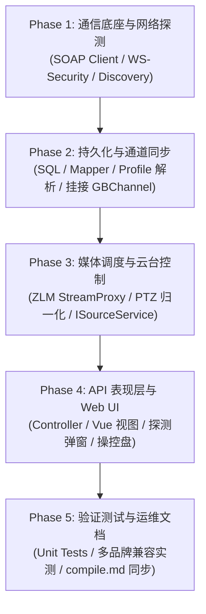

<!-- doc/reaticle_docs/onvif-implementation/README.md -->

# WVP-PRO ONVIF 协议支持五阶段实施细节工程指南

## 1 规划背景与工程全景

依据方案文档 [doc/reaticle_docs/onvif-support-solution.md](file:///d:/offices/Github/wvp-GB28181-pro/doc/reaticle_docs/onvif-support-solution.md)，本项目为 WVP-PRO 开源分支落地原生 ONVIF 协议支持，解决存量摄像头（海康、大华、宇视、雄迈等）在未配置 GB28181 SIP 服务时的标准化统一接入难题。

实施路线坚持**轻量原生自研 SOAP 引擎 + 宽容解析**，保证 **Zero-New-Dependency（零新增第三方 Maven 依赖）**，完全适配 Java 21 虚拟线程与 Spring Boot 3.4+ 架构体系。

工程拆分为以下 5 个高度解耦、前后递进的实施阶段：

---

## 2 五阶段实施细节文档索引

| 实施阶段 | 核心目标与交付范围 | 实施文档链接 |
|---|---|---|
| **Phase 1** | **轻量通信底座与网络搜寻引擎** - JDK 21 原生 HttpClient SOAP 传输客户端 - 动态时钟偏斜（Clock Skew）自动补偿与 WS-Security 签名 - 预编译 SOAP XML 模板工厂与基于 dom4j 的宽容模式解析器 - WS-Discovery UDP 多播（`239.255.255.250:3702`）与单播搜寻器 | [phase-1-soap-engine-and-discovery.md](file:///d:/offices/Github/wvp-GB28181-pro/doc/reaticle_docs/onvif-implementation/phase-1-soap-engine-and-discovery.md) |
| **Phase 2** | **数据持久化与设备/通道模型同步** - 增量 SQL DDL（MySQL/PostgreSQL/Kingbase/H2） - `OnvifDevice` 与 `OnvifChannel` 领域实体及 Mapper 数据访问层 - 设备连接握手、时钟校准与 Capabilities 能力集提取 - Profile 码流解析（RTSP URL / 快照）并级联同步至 `wvp_device_channel` (`data_type=4`) | [phase-2-persistence-and-channel-sync.md](file:///d:/offices/Github/wvp-GB28181-pro/doc/reaticle_docs/onvif-implementation/phase-2-persistence-and-channel-sync.md) |
| **Phase 3** | **流媒体调度与云台控制策略对接** - `SourcePlayServiceForOnvifImpl` (`@Service("sourceChannelPlayService4")`) - ZLMediaKit StreamProxy 代理拉流接管与 WebRTC/HTTP-FLV 分发 - `closeStreamOnNoneReader` 无人观看自动停流 - PTZ 坐标归一化模型（$V_{\text{wvp}} \in [0, 255] \to V_{\text{onvif}} \in [-1.0, 1.0]$）、平滑移动与松手即停制动 | [phase-3-media-proxy-and-ptz-control.md](file:///d:/offices/Github/wvp-GB28181-pro/doc/reaticle_docs/onvif-implementation/phase-3-media-proxy-and-ptz-control.md) |
| **Phase 4** | **RESTful API 表现层与前端 Web UI 集成** - `OnvifDeviceController` 与 `OnvifDiscoveryController` RESTful 端点 - 前端 Axios API 模块 (`web/src/api/onvif.js`) 与 Vue 路由注册 - 设备与通道管理视图主台账 (`views/onvif/index.vue`) - 局域网一键搜寻向导抽屉与分屏内嵌云台控制盘 (`views/onvif/ptzController.vue`) | [phase-4-restful-api-and-web-ui.md](file:///d:/offices/Github/wvp-GB28181-pro/doc/reaticle_docs/onvif-implementation/phase-4-restful-api-and-web-ui.md) |
| **Phase 5** | **联调测试、多品牌 IPC 验证与文档同步** - 探测器、签名算法与 PTZ 归一化 JUnit 5 单元测试用例 - 海康威视、大华、宇视、雄迈主流安防 IPC 兼容性实测与避坑指南 - 编译部署指南 [doc/reaticle_docs/compile.md](file:///d:/offices/Github/wvp-GB28181-pro/doc/reaticle_docs/compile.md) 端口放行与架构图增量更新 Patch - 生产交付与自检 Checklist | [phase-5-testing-verification-and-doc-sync.md](file:///d:/offices/Github/wvp-GB28181-pro/doc/reaticle_docs/onvif-implementation/phase-5-testing-verification-and-doc-sync.md) |

---

## 3 工程规范与约束基线

1. **架构契约**：所有新增类置于 `com.genersoft.iot.vmp.onvif` 独立包路径下，保持原有 SIP 信令栈 100% 物理隔离与解耦。
2. **依赖纯洁性**：严禁在 `pom.xml` 中引入 CXF、JAX-WS、Axis 等重量级外部框架，统一采用 JDK 21 原生 API 与现有依赖 `dom4j`。
3. **交付完整性**：各阶段文档中的代码范例均包含完整的包名、类型导入、异常处理及工程级日志，不存在伪代码或省略逻辑。
