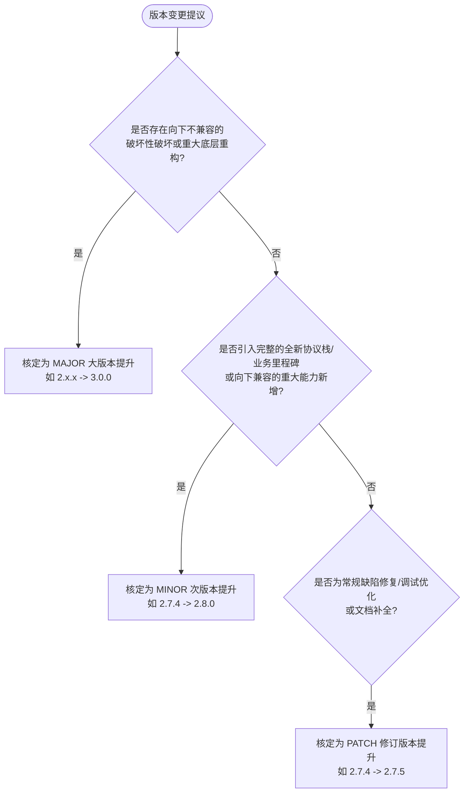
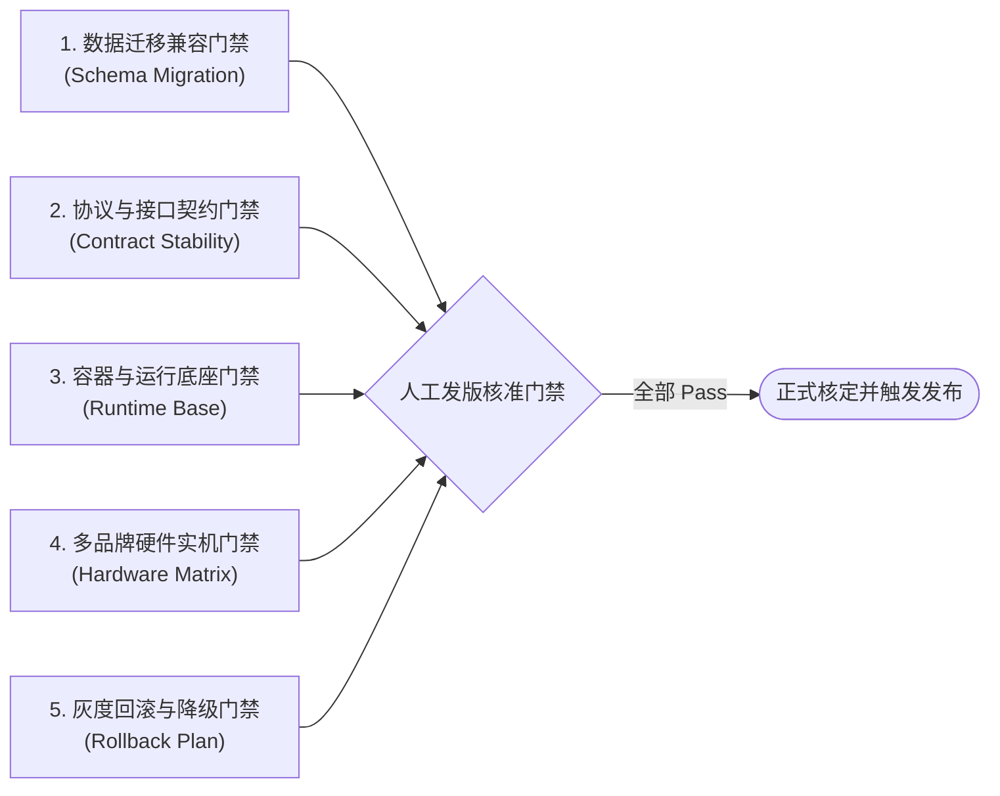
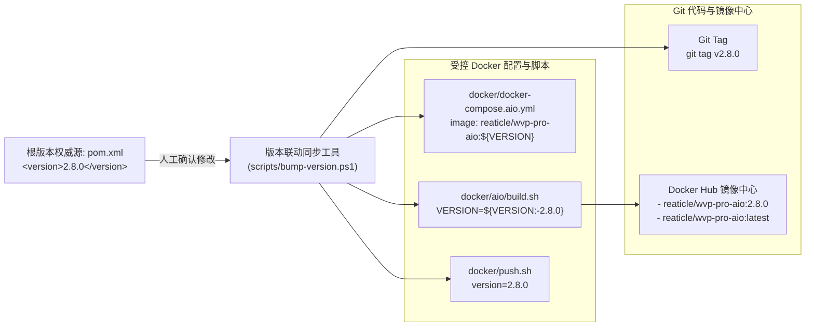
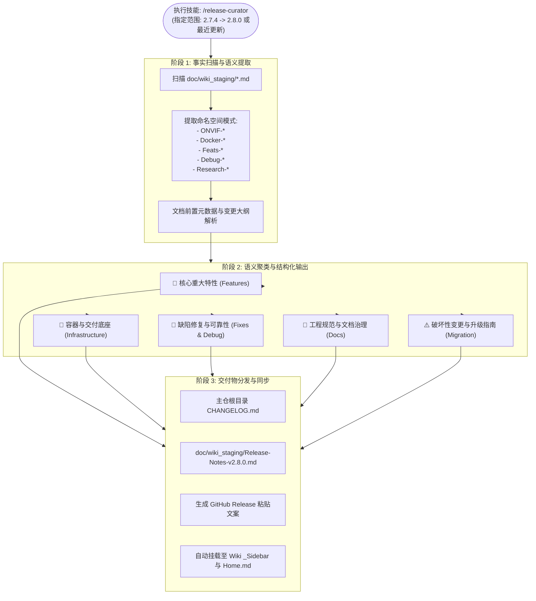
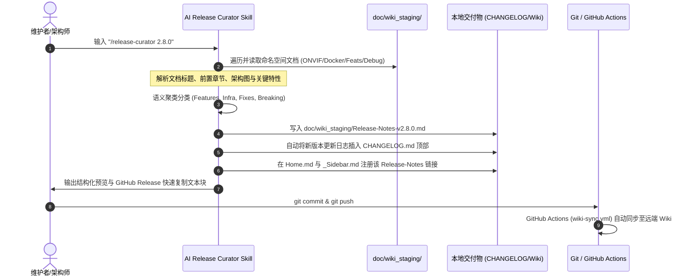
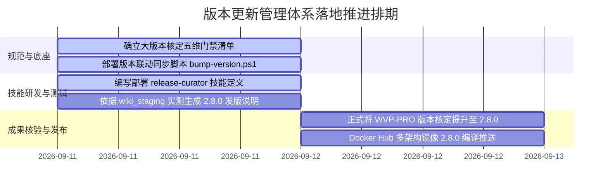

<!-- doc/reaticle_docs/release-automation-solution.md -->
# WVP-PRO 版本更新自动管理方案 (基于 Wiki Staging 与语义化版本控制)

本文档针对 WVP-PRO (GB28181 & ONVIF 双协议分支) 的版本管理、Docker 镜像发布联动、大版本人工核定门禁以及更新说明自动生成制定系统化管理方案。方案以 [doc/wiki_staging/](file:///d:/offices/Github/wvp-GB28181-pro/doc/wiki_staging) 作为版本变更的核心事实知识库，构建**「人工门禁核定大版本 + 单一信任源联动 Docker 发布 + 本地 AI Skill 自动化生成更新日志」**的全生命周期工程闭环。

---

## 1. 架构目标与现存痛点诊断

### 1.1 现存痛点剖析
1. **大版本界定标准模糊**：
   - 当前项目已陆续并入 ONVIF 原生全协议栈 (Phase 1~5)、Docker All-in-One 四合一极简容器交付、国标级联通道批量导入、GB28181 语音对讲与广播解耦重构等跨越式特性；
   - 团队缺乏明确的人工核定大版本 (Major / Minor) 的技术度量衡与门禁清单，导致具有破坏性变更或里程碑意义的功能依然挤在微小的修订版本 (如 `2.7.3` -> `2.7.4`) 中发布，外部用户对兼容性与升级风险缺乏预判。
2. **Docker 镜像发布版本管理割裂**：
   - 版本号分散配置在多个独立文件中：Maven [pom.xml](file:///d:/offices/Github/wvp-GB28181-pro/pom.xml) (`2.7.4`)、[docker/docker-compose.aio.yml](file:///d:/offices/Github/wvp-GB28181-pro/docker/docker-compose.aio.yml) (`reaticle/wvp-pro-aio:2.7.4`)、[docker/aio/build.sh](file:///d:/offices/Github/wvp-GB28181-pro/docker/aio/build.sh) (`VERSION=2.7.4`) 以及历史微服务脚本 [docker/push.sh](file:///d:/offices/Github/wvp-GB28181-pro/docker/push.sh) (`version=2.7.3`)；
   - 人工变更 Docker 发布版本时极易遗漏某处配置，导致 Docker 镜像 Tag、Compose 编排文件与后端 Jar 包运行版本不一致。
3. **更新日志编写滞后且碎片化**：
   - 传统依赖开发者人工在发版前追溯 Git Commit 记录，Commit 信息参差不齐（如 "fix bug", "update"），无法反映架构演进、业务价值与升级指南；
   - 本项目在 [doc/wiki_staging/](file:///d:/offices/Github/wvp-GB28181-pro/doc/wiki_staging) 与 [doc/reaticle_docs/](file:///d:/offices/Github/wvp-GB28181-pro/doc/reaticle_docs) 中沉淀了极为详尽的实施方案、Bug 复盘与架构设计，但缺乏工具将这些富文档自动化提炼为精准的 Release Notes。

### 1.2 建设目标
1. **确立大版本核定门禁 (Human-in-the-Loop SemVer Gate)**：建立量化的语义化版本 (SemVer) 判决矩阵与五维人工核定清单（数据架构、协议兼容、配置环境、真机互联、回滚预案）；
2. **规范 Docker 发布的单一信任源与联动机制**：确立以版本控制文件为权威源，支持环境变量动态覆盖与一键自动化同步脚本，杜绝配置漂移；
3. **研发本地 AI 发版技能 (`release-curator`)**：根据指定的版本范围或时间范围，自动扫描 [doc/wiki_staging/](file:///d:/offices/Github/wvp-GB28181-pro/doc/wiki_staging) 的结构化文档，精准分类生成企业级 Release Notes，并联动更新 Wiki 与 GitHub Releases。

---

## 2. 人工如何核定大版本？ (Major / Minor Decision Protocol)

### 2.1 语义化版本体系 (SemVer 2.0.0) 在安防视频平台的定义

项目版本遵循 `v{MAJOR}.{MINOR}.{PATCH}`（例如 `v2.7.4`）：



| 版本层级 | 变更性质 | 触发条件典型判定（结合当前工程特征） | 示例场景 |
| :--- | :--- | :--- | :--- |
| **MAJOR (主版本)**<br/>`X.0.0` | **破坏性变更 (Breaking Changes)** | 1. 运行时底层依赖重大升级（如 JDK 17 升级至 21，Spring Boot 2 升至 3.4.4）；<br/>2. 核心 SIP 信令或 RESTful 接口产生不向下兼容的字段删除或行为破坏；<br/>3. 数据库表结构发生不可逆平滑迁移的变更（如主键重命名、强制分库分表）；<br/>4. 媒体引擎交互协议整体颠覆（如从旧版 Hook 切换为全新的架构）。 | 历史旧版本升级至 JDK21+SpringBoot3+全栈虚拟线程，核定为主版本 `3.0.0`。 |
| **MINOR (次版本)**<br/>`2.X.0` | **重大特性闭环 (Major Milestone)** | 1. 引入全新设备协议栈并完成全生命周期功能闭环（向下兼容）；<br/>2. 全新交付形态上线（如 Docker All-in-One 单容器多架构交付体系）；<br/>3. 核心功能模块的重大重构且保持旧数据兼容（如语音对讲/广播解耦升级、国标自定义通道批量导入）；<br/>4. 引入向后兼容的增量数据库表与新 API 接口。 | **ONVIF 原生全协议栈 (Phase 1~5) 正式发布，符合次版本提升条件，强烈建议从当前 `2.7.4` 人工核定提升为 `2.8.0`**。 |
| **PATCH (修订版本)**<br/>`2.7.X` | **缺陷自愈与补丁 (Bug Fixes)** | 1. 单一模块的异常排查修复（如 ONVIF 批量导出覆盖与 ID 复用修复、时钟偏斜补偿修复）；<br/>2. 依赖库安全漏洞补丁（Bump dependency）；<br/>3. Wiki 文档自动化、构建脚本优化等工程治理变动。 | 修复 ONVIF WS-Discovery 端口冲突或 Excel 导入空指针异常，发布 `2.7.5`。 |

---

### 2.2 人工核定大版本的“五维门禁清单” (5-Dimension Review Gate)

在架构师或发版负责人核定提升 `MAJOR` 或 `MINOR` 版本前，必须逐项核对并签署以下门禁检查单：



#### 维度一：数据架构与持久化兼容性门禁 (Schema Compatibility)
- [ ] **增量 DDL 检查**：是否有针对旧版本数据库的无损迁移 SQL？（检查新增的 `wvp_onvif_device` 表、字段扩展是否带有安全默认值，严禁出现阻断旧数据的 `NOT NULL without DEFAULT`）。
- [ ] **数据自愈性**：新老设备 ID、通道国标编码冲突时是否具备容错与自愈能力（参考 [Debug-2026-09-11-Onvif-Batch-Export-Overwrite-And-Id-Reuse-Plan.md](file:///d:/offices/Github/wvp-GB28181-pro/doc/wiki_staging/Debug-2026-09-11-Onvif-Batch-Export-Overwrite-And-Id-Reuse-Plan.md)）。

#### 维度二：外部契约与协议向下兼容门禁 (Contract Stability)
- [ ] **SIP 信令兼容性**：GB28181-2016 与 2022 信令协议是否与主流国标级联上级/下级平台保持兼容。
- [ ] **RESTful API 契约**：前端 Axios 调用的既有 RESTful 端点（如 `/api/device/query`）入参和出参数据结构是否向前兼容，是否存在破坏性字段变动。

#### 维度三：容器交付与运行底座门禁 (Container & Environment)
- [ ] **挂载卷路径兼容性**：Docker 容器挂载目录结构是否变更？（如 All-in-One 镜像中的 `/var/lib/mysql`、`/opt/media/conf/config.ini` 是否允许旧版数据无缝平移挂载）。
- [ ] **系统端口稳定性**：对外暴露端口（HTTP `18080`、SIP `8116`、RTP `30000-30050`、ONVIF `3702` 等）是否发生冲突。

#### 维度四：安防硬件与多品牌互联互通门禁 (Hardware Matrix)
- [ ] **主流 IPC 实测覆盖**：海康威视 (Hikvision)、浙江大华 (Dahua)、宇视科技 (Uniview)、雄迈 (Xiongmai) 四大品牌硬件摄像头，是否在真机上完成点播、云台 PTZ 控制、语音对讲闭环验证（参考 [ONVIF-Phase-5-Testing-Verification-and-Doc-Sync.md](file:///d:/offices/Github/wvp-GB28181-pro/doc/wiki_staging/ONVIF-Phase-5-Testing-Verification-and-Doc-Sync.md)）。

#### 维度五：回滚与应急降级预案门禁 (Rollback & Fallback Plan)
- [ ] **回滚步骤完备**：当新版上线异常时，回滚至上一稳定版本（如从 `2.8.0` 回退至 `2.7.4`）的容器切换命令与数据库回退指南是否已在发布文档中明确。

---

## 3. 如何人工变更 Docker 发布的版本？ (Docker Release Protocol)

### 3.1 架构设计：单一信任源 (Single Source of Truth) 与联动矩阵

为了彻底消除多处硬编码导致的“版本漂移”，制定**以项目 Maven [pom.xml](file:///d:/offices/Github/wvp-GB28181-pro/pom.xml) 为根信任源**的级联联动架构：



---

### 3.2 人工变更 Docker 版本的标准操作程序 (SOP)

#### 步骤 1：变更版本号权威源并触发联动
开发者通过执行自动化脚本 [scripts/bump-version.ps1](file:///d:/offices/Github/wvp-GB28181-pro/scripts/bump-version.ps1)，一键同步整个代码库的版本声明：

```powershell
# 执行版本提升（例如从 2.7.4 提升至 2.8.0）
pwsh ./scripts/bump-version.ps1 -NewVersion "2.8.0"
```
脚本将自动完成以下变更：
1. 更新 [pom.xml](file:///d:/offices/Github/wvp-GB28181-pro/pom.xml) 中的 `<version>2.8.0</version>`；
2. 更新 [docker/aio/build.sh](file:///d:/offices/Github/wvp-GB28181-pro/docker/aio/build.sh) 默认变量 `VERSION="${VERSION:-2.8.0}"`；
3. 更新 [docker/docker-compose.aio.yml](file:///d:/offices/Github/wvp-GB28181-pro/docker/docker-compose.aio.yml) 中镜像标签为 `reaticle/wvp-pro-aio:2.8.0`；
4. 更新 [docker/push.sh](file:///d:/offices/Github/wvp-GB28181-pro/docker/push.sh) 中的 `version=2.8.0`。

#### 步骤 2：针对 Docker Compose 支持环境变量热注入 (Decoupled Compose)
在 [docker/docker-compose.aio.yml](file:///d:/offices/Github/wvp-GB28181-pro/docker/docker-compose.aio.yml) 中使用参数化声明：
```yaml
services:
  wvp-aio:
    image: reaticle/wvp-pro-aio:${WVP_VERSION:-2.8.0}
    container_name: wvp-aio
```
- **生产拉取任意指定版本**：无需修改 compose 文件内容，直接通过命令行指定：
  ```bash
  WVP_VERSION=2.8.0 docker compose -f docker-compose.aio.yml up -d
  ```

#### 步骤 3：多架构 Docker 镜像构建与发布 (Build & Push)
进入仓库根目录，执行多架构构建发布流水线：

```bash
# 场景 A：采用极速拼装模式（已存在本地编译的 wvp.jar 时，推荐）
mvn clean package -DskipTests
cp target/wvp-pro-*.jar ./wvp.jar
cp 数据库/init.sql ./init.sql

# 执行多架构构建并推送到 Docker Hub (自动打上了 2.8.0 与 latest 双 Tag)
./docker/aio/build.sh push

# 场景 B：指定临时测试版本构建（不污染代码库配置）
VERSION=2.8.0-rc1 ./docker/aio/build.sh push
```

#### 步骤 4：远端 Manifest List 与多架构验证门禁
发布完成后，必须在终端执行 inspect 核查，确认 `linux/amd64` 与 `linux/arm64` 两个平台的 Digest 均已正常挂载在同一个 Manifest Tag 下：

```bash
docker buildx imagetools inspect reaticle/wvp-pro-aio:2.8.0
```
返回中必须包含以下关键架构指纹：
- `MediaType: application/vnd.docker.distribution.manifest.list.v2+json`
- `Platform: linux/amd64`
- `Platform: linux/arm64`

---

## 4. 本地 AI Skill 研发与使用指引：更新说明自动化生成器 (`release-curator`)

### 4.1 技能架构与设计理念

为了摆脱“无意义的 Git 提交日志拼凑”，我们研发本地专用技能 **`release-curator`**（发布编目与更新说明生成器）。
该技能将 [doc/wiki_staging/](file:///d:/offices/Github/wvp-GB28181-pro/doc/wiki_staging) 视为**权威变更事实库 (Ground Truth Knowledge Base)**。



---

### 4.2 文档命名空间与分类映射规则矩阵

`release-curator` 依据 [doc/wiki_staging/](file:///d:/offices/Github/wvp-GB28181-pro/doc/wiki_staging) 的前缀约定进行无歧义的语义分流：

| Wiki 命名空间模式 | 对应变更分类 | 提取重点与元数据来源 |
| :--- | :--- | :--- |
| `ONVIF-Phase-*.md` / `ONVIF-Support-*.md` | **🚀 核心重大特性 (Major Features)** | 协议能力扩展、时钟动态补偿、云台 PTZ 归一化、新增表与 RESTful API |
| `Docker-All-in-One-*.md` | **🐳 交付基础设施 (Infrastructure & Deployment)** | 四合一镜像构建、多架构支持、自愈 Entrypoint、存储挂载规范 |
| `Feats-*.md` | **✨ 业务功能增强 (Enhancements)** | 国标通道批量导入 (EasyExcel)、GB28181 语音对讲与广播分离解耦 |
| `Debug-*.md` | **🐛 缺陷修复与自愈 (Bug Fixes & Reliability)** | 根因剖析、主键冲突自愈、防重复覆盖、连接泄漏防卫 |
| `Research-*.md` | **🔬 深度排查与机理复盘 (Investigations & Analysis)** | 网络抓包证据、SIP INVITE 流程复盘、音频协商规范 |
| `Wiki-*.md` / `Compile-*.md` | **📖 开发者体验与文档 (Documentation & Tooling)** | 本地 AI 编目、CI 持续同步、多环境编译指引 |

---

### 4.3 技能代码部署规范 (`SKILL.md`)

该技能同时部署于两个核心路径，确保 Antigravity IDE 与全局环境无缝调用：
1. **工作区本地路径**：[.agents/skills/release-curator/SKILL.md](file:///d:/offices/Github/wvp-GB28181-pro/.agents/skills/release-curator/SKILL.md)
2. **全局自定义路径**：`C:\Users\Reaticle\.gemini\config\skills\release-curator\SKILL.md`

---

### 4.4 `release-curator` 实操使用说明手册

#### 4.4.1 常见调用指令语法
在日常开发或发版窗口期，开发者可在对话框中直接触发该技能。技能支持以下四种交互范式：

1. **缺省智能探测模式（推荐）**：
   ```text
   /release-curator
   ```
   - **行为**：技能自动读取当前 [pom.xml](file:///d:/offices/Github/wvp-GB28181-pro/pom.xml) 的版本号（如 `2.7.4`），探测 Git 最近一次 Tag，若未发现新 Tag，会主动提示：“当前基线版本为 `2.7.4`，检测到大量 ONVIF 与 All-in-One 新特性，建议目标版本为 `2.8.0`，是否继续生成？”

2. **显式指定目标版本模式**：
   ```text
   /release-curator 2.8.0
   ```
   - **行为**：直接锁定目标版本号为 `2.8.0`，扫描全量资产并生成对应的发版说明。

3. **版本跃迁区间对比模式**：
   ```text
   /release-curator 2.7.4..2.8.0
   ```
   - **行为**：严格提取从 `2.7.4` 到 `2.8.0` 期间变动的文档，过滤掉历史已被归档的早先版本说明。

4. **时间窗口增量扫描模式**：
   ```text
   /release-curator 汇总最近一周的文档变更并生成更新说明
   ```
   - **行为**：结合文件修改时间与 Git 日志，仅提取最近 7 天内新增或变动的 `doc/wiki_staging/` 页面。

---

#### 4.4.2 技能端到端执行流程 (Step-by-Step Walkthrough)

以执行 `/release-curator 2.8.0` 为例，技能内部的自动化执行轨迹如下：



1. **文档探测与解析**：
   - 技能自动定位到工程根目录下的 `doc/wiki_staging/` 目录；
   - 提取各页面前置元数据与章节结构（如 `# 核心特性与架构升级`、`## 3. 持久化与通道同步` 等）；
2. **聚类与多维提炼**：
   - 归集新增能力并自动提炼出“一句话价值概述”；
   - 识别出数据库变动（`wvp_onvif_device` 表结构）与 Docker 端口映射变动，自动归入 **⚠️ 升级指南与兼容性说明**；
3. **交付物落盘与闭环同步**：
   - 生成全新的独立 Wiki 页面：`doc/wiki_staging/Release-Notes-v2.8.0.md`；
   - 更新 `doc/wiki_staging/_Sidebar.md`，在“版本记录与发布日志”分类下追加当前版本；
   - 自动在主仓根目录 `CHANGELOG.md` 追加标准 Keep a Changelog 格式条目；
   - 在控制台中生成 GitHub Release 页面所需的纯文本，供发版人员直接粘贴。

---

### 4.5 标杆交付物样例：由 `release-curator` 生成的 `Release-Notes-v2.8.0.md`

以下是技能基于当前 [doc/wiki_staging/](file:///d:/offices/Github/wvp-GB28181-pro/doc/wiki_staging) 资产实时提取合成的完整发布说明样例：

````markdown
# WVP-PRO v2.8.0 发布说明 (Release Notes)

> **发布日期**：2026-09-11  
> **核心里程碑**：原生 ONVIF 协议全生命周期支持闭环、Docker All-in-One 多架构一体化镜像首发、国标语音对讲与广播分离解耦重构。

---

## 🌟 核心特性 (Key Features)

### 1. 原生自研 ONVIF 协议栈全生命周期闭环 (Phase 1 ~ Phase 5)
- **Zero-New-Dependency 架构**：采用 JDK 21 原生 HttpClient 与现有 dom4j 宽容解析实现轻量 SOAP 引擎，零引入 Axis/CXF 等笨重依赖；
- **局域网设备组播发现**：实现 WS-Discovery (UDP 3702) 自动探测，支持毫秒级检索局域网内海康、大华、宇视、雄迈等 IPC 设备；
- **时钟偏斜动态补偿机制**：针对设备与服务器系统时钟不一致导致的 WS-Security 401 鉴权拒绝，实现毫秒级时钟差自适应感知与重试重放补偿；
- **流媒体调度与 PTZ 归一化**：全面打通 ZLMediaKit StreamProxy 代理拉流接管，构建三维连续移动与相对移动坐标归一化模型；
- **全套 RESTful API 与 Web UI**：完成设备台账增删改查、探测列表一键入网、流媒体点播播放器与云台操控盘界面开发。
- **详见文档**：[ONVIF 协议支持技术实施方案](ONVIF-Support-Solution)、[ONVIF 五阶段实施工程总览](ONVIF-Implementation-Guide)。

### 2. 国标级联通道批量导入与自定义重命名
- **EasyExcel 批量数据处理**：支持从 Excel 模板批量解析千路级自定义通道国标编码与名称，建立级联映射关系；
- **详见文档**：[国标级联自定义通道编码批量导入方案](Feats-GB-Cascade-Custom-Channel-Batch-Excel-Solution)。

### 3. GB28181 语音对讲与广播信令解耦重构
- **解耦独立信令**：将混杂的对讲与广播流程彻底拆分为独立业务状态机，优化双向音频传输稳定性与 ZLM 端口动态分配逻辑；
- **详见文档**：[GB28181 语音对讲与广播升级改造方案](Feats-GB28181-Voice-Talk-and-Broadcast-Upgrade-Solution)。

---

## 🐳 容器与交付体系 (Docker & Infrastructure)

### 1. Docker All-in-One 四合一极简容器交付
- **单容器全栈整合**：将 WVP-PRO、ZLMediaKit、MariaDB 与 Redis 深度整合至单个生产级容器中，体积压缩至约 300MB；
- **多架构原生兼容**：支持 `linux/amd64` 与 `linux/arm64`（Apple Silicon / 华为鲲鹏 / 飞腾）双架构；
- **自愈 Entrypoint 守护**：内置环境变量模板注入、MariaDB 数据目录自动初始化、MySQL 健康就绪轮询与优雅停机自愈机制；
- **镜像拉取**：`docker pull reaticle/wvp-pro-aio:2.8.0`（亦支持 `latest` 别名）；
- **详见文档**：[All-in-One 镜像合并打包架构方案](Docker-All-in-One-Solution)、[Docker All-in-One 实施细则](Docker-All-in-One-Implementation)。

---

## 🐛 缺陷修复与系统自愈 (Bug Fixes & Reliability)

- **ONVIF 批量导出主键冲突自愈**：修复设备重复导入时产生主键冲突异常，引入 `ON DUPLICATE KEY UPDATE` 与内存 ID 动态复用保障；
- **WS-Discovery 端口争抢防御**：在 Windows 与 Linux 环境下强化组播套接字复用标志 (`SO_REUSEADDR`)，避免与其他服务冲突；
- **详见文档**：[ONVIF 批量导出覆盖与 ID 复用优化方案](Debug-2026-09-11-Onvif-Batch-Export-Overwrite-and-Id-Reuse-Plan)。

---

## ⚠️ 升级指南与兼容性说明 (Migration & Breaking Changes)

### 1. 数据库结构变迁 (增量 SQL)
从旧版本升级时，必须在现有 MySQL 数据库中执行以下增量 DDL：
```sql
CREATE TABLE IF NOT EXISTS `wvp_onvif_device` (
  `id` int(11) NOT NULL AUTO_INCREMENT,
  `device_id` varchar(50) NOT NULL COMMENT '归一化设备编码',
  `name` varchar(255) DEFAULT NULL COMMENT '设备名称',
  `ip` varchar(50) NOT NULL COMMENT '设备IP',
  `port` int(11) NOT NULL COMMENT 'ONVIF服务端口',
  `username` varchar(50) DEFAULT NULL COMMENT '鉴权用户名',
  `password` varchar(50) DEFAULT NULL COMMENT '鉴权密码',
  `create_time` datetime DEFAULT CURRENT_TIMESTAMP,
  PRIMARY KEY (`id`),
  UNIQUE KEY `uk_onvif_device_id` (`device_id`)
) ENGINE=InnoDB DEFAULT CHARSET=utf8mb4 COMMENT='ONVIF协议设备扩展表';
```

### 2. Docker 部署挂载映射说明
若从旧版分布式容器迁移至 All-in-One 架构，挂载数据卷目录必须遵循新的物理路径规约：
```bash
-v /opt/wvp-aio-data/data/mysql:/var/lib/mysql \
-v /opt/wvp-aio-data/data/record:/opt/media/bin/www/record \
-v /opt/wvp-aio-data/logs:/opt/wvp/logs
```
````

---

### 4.6 异常排查与常见问题应对指南 (Troubleshooting)

| 异常现象 | 触发原因 | 恢复与应对指引 |
| :--- | :--- | :--- |
| **执行提示：未检测到有效文档源** | 工作区目录未设置或重构了 `doc/wiki_staging/` 路径 | 检查是否存在 `doc/wiki_staging/` 或在对话中显式指定源路径：`/release-curator --source doc/reaticle_docs`。 |
| **版本号格式校验不通过** | 输入了非标准版本字符串（如 `2.8` 或 `v2.8.0.1`） | 遵循 SemVer 规范，输入 `MAJOR.MINOR.PATCH` 格式，如 `2.8.0` 或带预发布后缀 `2.8.0-rc1`。 |
| **缺失某命名空间文档** | 某分类（如 `Debug-*`）近期无对应文件 | 技能具备弹性缺省机制，自动跳过空分类，不会导致生成过程中断。 |
| **GitHub Actions Wiki 推送 403** | 仓库未配置 `WIKI_SYNC_TOKEN` 凭据 | 确认已在 GitHub 仓库 Settings -> Secrets 中添加具备 repo 权限的 Personal Access Token 并命名为 `WIKI_SYNC_TOKEN`。 |

---

## 5. 本地版本同步辅助脚本设计与实施

为了配合人工变更 Docker 版本及项目全局版本，创建 PowerShell 联动脚本 [scripts/bump-version.ps1](file:///d:/offices/Github/wvp-GB28181-pro/scripts/bump-version.ps1)。

### 5.1 核心脚本能力
- **格式严格校验**：校验输入版本号是否符合 `X.Y.Z` 或 `X.Y.Z-rcN` 格式；
- **全链路原子替换**：
  - 读取并替换 [pom.xml](file:///d:/offices/Github/wvp-GB28181-pro/pom.xml) 中顶层 `<version>` 标签；
  - 替换 [docker/aio/build.sh](file:///d:/offices/Github/wvp-GB28181-pro/docker/aio/build.sh) 中的默认 `VERSION="${VERSION:-...}"`；
  - 替换 [docker/docker-compose.aio.yml](file:///d:/offices/Github/wvp-GB28181-pro/docker/docker-compose.aio.yml) 中的 `reaticle/wvp-pro-aio:...`；
  - 替换 [docker/push.sh](file:///d:/offices/Github/wvp-GB28181-pro/docker/push.sh) 中的 `version=...`；
- **Git 状态感知**：提示用户当前变动并给出后续 Git Tag 与推送指令建议。

---

## 6. 综合实施路线图 (Actionable Roadmap)



1. **第一步（即刻执行）**：创建与部署 `.agents/skills/release-curator/SKILL.md` 与 `scripts/bump-version.ps1`；
2. **第二步（发版演练）**：调用 `/release-curator` 技能，根据当前的 `doc/wiki_staging` 文档资产，试运行生成 `Release-Notes-v2.8.0.md`；
3. **第三步（大版本核准）**：依据“五维门禁清单”，将汇聚了 ONVIF 与 All-in-One 的新版本正式从 `2.7.4` 提升为 `2.8.0`；
4. **第四步（CI/CD 流水线联动）**：触发 `wiki-sync.yml` 与 Docker 镜像发布，实现全网文档与容器版本对齐。
