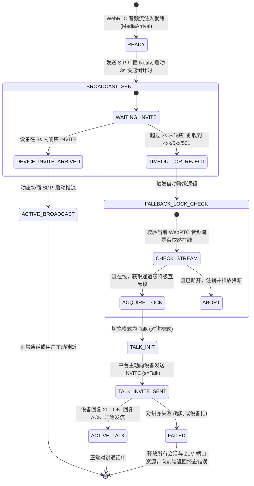

# 国标 GB/T 28181 语音喊话与对讲全链路升级系统分析与技术方案

## 1 Objectives

### 1.1 需求定位与背景
在 WVP-PRO 接入各类安防监控设备（IPC/NVR/网络音柱/对讲终端）的生产实践中，语音喊话（Broadcast）与语音对讲（Talk）是故障率极高的业务场景。依据调研报告 [gb28181-voice-talk-and-broadcast-failure-analysis.md](Research-Gb28181-Voice-Talk-And-Broadcast-Failure-Analysis)，“设备无响应或现场扬声器无声音”并非由于传统的语音音频编码（G.711A）算法不兼容，而是由于异构设备生态在 **通道能力定义（L0）**、**信令时序交互（L1）**、**公网 NAT 路由（L2）** 以及 **媒体容器封装与载荷协商（L3）** 上存在全链路断裂。

当前平台在语音广播处理链路中存在多项硬编码限制与单向不可逆时序（如硬编码裸 RTP PT=8、广播等待设备 INVITE 超时 10 秒即直接失败、完全信任设备 SDP 私网 IP 等）。本方案旨在通过确定性的架构改造与防御式设计，彻底解决异构厂商设备在国标语音业务中的不兼容瓶颈。

### 1.2 方案核心目标
1. **动态媒体载荷与 PS 封装自适应引擎（消除 PT=8 硬编码）**：
   - 解析设备反向发起 INVITE 中的 SDP 媒体声明（`m=audio` 与 `a=rtpmap`），动态决策采用 Raw RTP（PT=8/0）或 MPEG2-PS 封装（PT=96）；
   - 在平台响应的 200 OK SDP 与下发至 ZLMediaKit（ZLM）的推流参数中保持绝对一致，彻底兼容宇视（Uniview）、科达（Keda）等强校验 PS 封装的安防设备。
2. **广播超时自愈与智能降级回退机制（Broadcast -> Talk 无感平滑切换）**：
   - 针对业内 70% 设备不支持反向呼叫中心（不回 INVITE）或直接拒斥广播（返回 4xx/5xx/501）的现状，设计自适应降级调度机；
   - 在广播等待超时（可配 3~5 秒）或收到拒斥信令后，自动无缝降级为平台主动向设备发起 INVITE 的 Talk（对讲）模式，保障前端喊话一次性成功率。
3. **公网 NAT 智能路由感知与推流目标纠偏**：
   - 在跨公网 NAT 混合组网且采用 UDP 传输时，检测设备 SDP 声明的 RFC 1918 私网 IP；
   - 结合 SIP 协议栈最外层 `Via` 头部的 `received` 与 `rport` 属性，智能纠偏 ZLM 发流目标地址，消除“单向公网发往私网”的路由黑洞。
4. **前端人机交互容错与通道智能引导**：
   - 优化前端交互状态机，引导用户优先使用对讲模式，并前置麦克风采集安全上下文（HTTPS/localhost）拦截；
   - 智能关联/过滤具有音频输出属性（国标 137 通道）的点位，提供清晰的对讲建立进度与自愈反馈。

---

## 2 Constraints & Boundary Contract Matrix

### 2.1 协议、系统与运行时边界契约矩阵

| 交互层级 | 约束对象 | 硬性约束规范与协议边界 (RFC / GB) | 容错与防御策略 |
| :--- | :--- | :--- | :--- |
| **L0 通道实体** | 国标点位编码规范与硬件物理属性 | 1. GB/T 28181 附录 D 编码规则：第 11-13 位中，`131/132` 为摄像机，`137` 为音频输出通道，`138` 为音频输入通道；<br>2. 枪机/半球可能完全未外接扬声器/功放硬件。 | 1. 通道选择时，若设备上报了 137 通道，前端弹窗优先绑定或推荐该通道；<br>2. 若在 131/132 视频通道发起对讲失败，提示用户核实设备物理通道与外接功放接线。 |
| **L1 信令交互** | GB28181 广播时序 vs 对讲时序 (RFC 3261) | 1. GB 广播规范（附录 C.3.3）：平台发送广播 Notify -> 设备回复 200 OK -> **设备向平台发送 INVITE**；<br>2. Talk 对讲规范：平台主动向设备发送 INVITE（`s=Talk` 或 `s=Play`）；<br>3. 大量非标设备收到广播 Notify 不发 INVITE，造成信令悬挂。 | 1. 广播超时阈值由 10s 缩减为可配的快速自适应阈值（默认 3s）；<br>2. 超时或收到 4xx/5xx 时，状态机原子切换，自动转入平台主动发 INVITE 的 Talk 流程；<br>3. 设置防竞态锁（Distributed Lock/CAS），避免设备延迟到达的 INVITE 与降级 Talk 发生信令冲突（SIP 491 Request Pending）。 |
| **L1 信令时钟** | 发流时序与 ACK 依赖契约 | 部分厂商（如大华 Dahua）在收到 200 OK 后立即开始收流与建链；若平台等待收到 ACK 后才调 ZLM 发流，设备端会因握手超时而强行断链。 | 保留并完善 `broadcastPushAfterAck` 字段逻辑：对大华等已知设备默认设为 `false`（回复 200 OK 立即发流）；针对标准合规设备设为 `true`（收到 ACK 发流）。 |
| **L2 网络传输** | 跨公网 NAT 路由与对称穿透 (RFC 3581 / RFC 1918) | 1. 跨公网下设备 SDP 声明内网 IP（`10.x`, `172.16-31.x`, `192.168.x`）；<br>2. 若传输协议为 UDP，向该内网 IP 发包必然路由失败；<br>3. 设备防火墙对外阻断未经打洞的主动 UDP 包。 | 1. 实施 RFC 1918 命中检测：若 SDP IP 为私网 IP 且媒体为 UDP，提取 SIP Request 的 `ViaHeader.getReceived()` 与 `ViaHeader.getRport()` 作为发流地址；<br>2. 引导与支持设备切换为 `TCP-ACTIVE`（设备主动连 ZLM 开放端口）。 |
| **L3 媒体封装** | 载荷类型 (PT) 与封装容器 (RFC 3550 / ISO 13818-1) | 1. GB/T 28181 媒体协商要求：音频格式一般为 G.711A（PCMA, 8000Hz）；<br>2. 宇视、科达等设备强制要求 MPEG2-PS 封装（PT=96，Pack Header `0x000001BA`）；<br>3. 海康、大华多兼容 Raw RTP（PT=8）。硬编码 PT=8 会直接导致 PS 设备静音丢包。 | 1. 解析设备 INVITE 的 SDP `m=audio` 行及其子属性 `a=rtpmap`；<br>2. 若包含 `96`（或 `PS`），则设置 `sendRtpItem.setPt(96); sendRtpItem.setUsePs(true);`，SDP 回复 `a=rtpmap:96 PS/90000`；<br>3. 若包含 `8`，则回退裸 RTP `PT=8`；包含 `0` 则回退 `PT=0`；<br>4. ZLM `startSendRtp` 动态传参 `pt` 与 `use_ps`。 |
| **L4 前端采集** | W3C WebRTC 安全上下文约束 | 现代浏览器强制要求：麦克风/摄像头媒体采集 API（`getUserMedia`）仅在安全上下文（`https://` 或 `http://localhost`）中可用。 | 前端初始化时增加环境前置检测。若非安全环境，即刻阻断点击并弹出强告警引导配置 SSL 证书，避免无感失败。 |

---

## 3 Architecture

### 3.1 架构分层与处理流拓扑

```mermaid
graph TD
    subgraph Frontend [前端人机交互与推流层]
        UI[audioTalk.vue 语音交互对话框] -->|1. 校验 HTTPS 上下文| EnvCheck{是否安全上下文?}
        EnvCheck -- 否 --> ShowSSLError[弹出安全配置提示并阻断]
        EnvCheck -- 是 --> SelectChannel[智能关联 137/131 通道]
        SelectChannel --> CallStartAPI[调用 /api/play/broadcast 或 talk]
        CallStartAPI --> WebRTCClient[ZLMRTCClient 推送麦克风流]
    end

    subgraph Controller_Service [信令控制与降级调度层]
        CallStartAPI --> PlayCtrl[PlayController]
        PlayCtrl --> PlayService[PlayServiceImpl]
        PlayService -->|生成 WebRTC 推流地址| ZLMClient[ZLMediaKit REST Client]
        WebRTCClient -.->|推流就绪 MediaArrival| ZLMHook[ZLMMediaNodeServerService]
        ZLMHook -->|触发音频就绪事件| PlayService
        
        PlayService -->|尝试语音广播| BroadcastEngine[广播调度逻辑]
        BroadcastEngine -->|发送 SIP Notify| Cmder[SIPCommander.audioBroadcastCmd]
        BroadcastEngine -->|启动自适应定时器 3s| FallbackTimer[Fallback Scheduler]
        
        FallbackTimer -->|未收到 INVITE / 收到 4xx| TriggerFallback[执行自愈降级]
        TriggerFallback -->|原子状态转换| TalkEngine[Talk 对讲调度逻辑]
        TalkEngine -->|主动向设备发 INVITE| CmderTalk[SIPCommander.talkCmd]
    end

    subgraph SIP_Stack [SIP 信令处理与协商引擎]
        Cmder -->|SIP MESSAGE| DeviceNode[安防前端设备]
        DeviceNode -.->|若支持广播: 回复 INVITE| InviteReq[InviteRequestProcessor]
        DeviceNode -.->|若不支持: 回复 4xx/5xx 或静默| FallbackTimer
        
        InviteReq --> DynamicNegotiator[动态 SDP 协商与 NAT 探测引擎]
        DynamicNegotiator -->|解析 m=audio / rtpmap| DetectMediaFormat[PS 96 / Raw RTP 8/0 判决]
        DynamicNegotiator -->|解析 Via received/rport| DetectNatIp[公网真实 IP 纠偏]
        
        DetectMediaFormat --> SendRtpConfig[构建 SendRtpInfo]
        DetectNatIp --> SendRtpConfig
        SendRtpConfig --> SendOkCmd[InviteRequestProcessor.sendOk]
        SendOkCmd -->|响应 200 OK 带匹配 SDP| DeviceNode
        SendOkCmd -->|通知推流| ZLMStartSend[ZLM: startSendRtp]
    end

    subgraph Media_Plane [媒体面与推流执行]
        ZLMStartSend --> ZLMServer[(ZLMediaKit 媒体服务器)]
        WebRTCClient -->|WebRTC Opus/PCMA| ZLMServer
        ZLMServer -->|按照协商参数: PS(PT=96) 或 Raw(PT=8)| RTPOut[RTP/UDP/TCP Audio Stream]
        RTPOut -->|直达设备音频输入端口| DeviceNode
    end
```

### 3.2 动态媒体载荷协商决策模型（L3 适配）

在接收到设备发来的语音 INVITE 请求时，平台严禁采用静态配置，必须按照如下状态决策树匹配推流格式：

```text
设备 INVITE SDP: m=audio <port> <proto> <fmt list...>
                    │
                    ▼
     检查 fmt list 中是否存在 "96" 或 "PS"?
         ├──【YES】: 设置 usePs = true, pt = 96, rtpmap = "96 PS/90000"
         └──【NO】 :
                 │
                 ▼
     检查 fmt list 中是否存在 "8" 或 "PCMA"?
         ├──【YES】: 设置 usePs = false, pt = 8, rtpmap = "8 PCMA/8000/1"
         └──【NO】 :
                 │
                 ▼
     检查 fmt list 中是否存在 "0" 或 "PCMU"?
         ├──【YES】: 设置 usePs = false, pt = 0, rtpmap = "0 PCMU/8000/1"
         └──【NO】 :
                 │
                 ▼
     默认回退保底: usePs = false, pt = 8, rtpmap = "8 PCMA/8000/1"
```

平台响应 200 OK 时生成的 SDP 必须与判决结果绝对闭合：
- 若 `usePs == true`：
  ```sdp
  m=audio {localPort} {proto} 96
  a=rtpmap:96 PS/90000
  a=sendonly
  y={ssrc}
  f=v/////a/1/8/1
  ```
- 若 `usePs == false`：
  ```sdp
  m=audio {localPort} {proto} {pt}
  a=rtpmap:{pt} {PCMA/PCMU}/8000/1
  a=sendonly
  y={ssrc}
  f=v/////a/1/8/1
  ```

### 3.3 广播超时自愈与智能降级状态机（L1 适配）

为杜绝非标设备“等待 10 秒超时后彻底放弃”的体验断崖，系统引入有限状态机（FSM）与降级防竞态控制：



#### 防竞态与锁契约（Race Condition Guard）
- **触发降级时**：必须在 Redis/内存中标记 `isFallbackToTalk = true` 并清空之前的广播等待 key；
- **极端竞态处理**：若设备在 3.1 秒延迟送达广播 INVITE，而此时已进入降级 Talk 流程，`InviteRequestProcessor` 检测到该通道处于降级状态，直接回复 `SIP 491 Request Pending` 或 `SIP 486 Busy Here`，避免推流通道冲突与双会话覆写。

### 3.4 公网 UDP NAT 智能 IP 纠偏模型（L2 适配）

在设备跨 NAT 映射接入云端 WVP 场景下，针对 UDP 传输协议，构建地址探测算法：

```text
输入: SessionDescription sdp, SIPRequest request, boolean isUdp
输出: String targetIp, int targetPort

1. 获取 sdpIp = sdp.getOrigin().getAddress();
2. 获取 sdpPort = media.getMediaPort();
3. 如果 NOT isUdp:
     返回 sdpIp, sdpPort (TCP 模式依赖主动建链握手，不受此约束)
4. 判断 sdpIp 是否属于 RFC 1918 私网网段:
     - 10.0.0.0 ~ 10.255.255.255
     - 172.16.0.0 ~ 172.31.255.255
     - 192.168.0.0 ~ 192.168.255.255
     - 127.0.0.0 ~ 127.255.255.255
     - 169.254.0.0 ~ 169.254.255.255
5. 若 sdpIp 属于私网网段:
     读取 request 顶层 ViaHeader:
       viaReceived = viaHeader.getReceived();
       viaRport = viaHeader.getRport();
     如果 viaReceived 非空且有效:
       targetIp = viaReceived;
       log.warn("[语音NAT纠偏] 检测到设备 SDP 声明私网地址 {}:{}，纠偏为公网映射 IP: {}", sdpIp, sdpPort, targetIp);
6. 返回 targetIp, sdpPort (注: 若开启对称 RTP，端口依赖后续首包对齐)
```

---

## 4 Work Breakdown Structure (WBS)

```text
WBS: 国标语音喊话与对讲全链路升级工程
├── 1. 动态媒体协商与 PS 封装自适应引擎 (InviteRequestProcessor)
│   ├── 1.1 扩展 SdpUtils/SDP 解析器，提取 m=audio 的 Payload Types 与 a=rtpmap 列表
│   ├── 1.2 实现 PS(96) / PCMA(8) / PCMU(0) 动态优先级判决逻辑
│   ├── 1.3 改造 sendRtpItem 配置注入，同步设置 pt、usePs、onlyAudio 等核心属性
│   ├── 1.4 重构 sendOk 方法中 200 OK SDP 响应体的组装，保证 rtpmap、fmt 与媒体流完全闭合
│   └── 1.5 适配 ZLM startSendRtp 动态参数投递
├── 2. 广播快速超时自愈与 Talk 降级调度机 (PlayServiceImpl & AudioBroadcastManager)
│   ├── 2.1 将硬编码的 10 秒超时缩减为配置项（默认 3 秒自适应阈值）
│   ├── 2.2 扩展广播超时回调：判断 WebRTC 流存活状态，触发降级调度
│   ├── 2.3 捕获 SIPCommander.audioBroadcastCmd 的 4xx/5xx 错误响应，立即中断等待并触发降级
│   ├── 2.4 实现原子降级控制器：安全清理旧 Broadcast 上下文，无缝调用 talkCmd 发起主动呼叫
│   └── 2.5 增加分布式锁/状态标，杜绝迟到 INVITE 与降级 Talk 的 SIP 491 竞态冲突
├── 3. 公网 NAT 探测与目标发流纠偏机制 (InviteRequestProcessor & SendRtpServerService)
│   ├── 3.1 引入 IP 地址分类工具类，支持严格识别 RFC 1918 私网 IPv4 地址
│   ├── 3.2 针对 UDP 广播场景，提取 SIP Request 的 Via 头部 received 与 rport 参数
│   ├── 3.3 替换 sendRtpServerService.createSendRtpInfo 中的目标 IP，规避公网发往私网的路由黑洞
│   └── 3.4 增加发流 IP 纠偏审计日志，便于现场快速诊断网络拓扑
├── 4. 前端视图体验与人机交互防御工程 (audioTalk.vue & edit.vue)
│   ├── 4.1 在 audioTalk.vue 挂载时增加 window.isSecureContext / HTTPS 守卫，提供直观配置向导
│   ├── 4.2 优化模式交互：优先推荐并默认选中“对讲”模式，标明喊话与对讲的适用场景差异
│   ├── 4.3 点位通道智能适配：检测到当前设备存在 137 通道时自动推荐绑定，提示非 137 通道的无声排查
│   ├── 4.4 增强状态流转提示：增加“正在协商媒体格式”、“广播无响应，自动切换为主动对讲”、“通话建立成功”细粒度状态
│   └── 4.5 在设备编辑页（edit.vue）为 broadcastPushAfterAck 增加厂商预设说明与交互引导
└── 5. 综合验证与厂商矩阵化回归测试
    ├── 5.1 宇视/科达设备测试：验证 SDP 协商出 PT=96，ZLM 正常送出 MPEG2-PS 封包，现场喇叭发声正常
    ├── 5.2 海康/大华设备测试：验证 BroadcastPushAfterAck 开关对大华建链的有效性，Raw RTP PT=8 正常播放
    ├── 5.3 广播不支持设备自愈测试：人工模拟/接入不支持广播的摄像机，验证 3 秒内平滑自动降级为 Talk 成功接通
    └── 5.4 公网云部署 + 私网设备跨 NAT 测试：验证 Via 纠偏 IP 生效，UDP 单向音频流正常到达设备
```

---

## 5 Acceptance Criteria

### 5.1 功能完整性指标
1. **PS 封装与载荷自适应能力**：
   - 接入要求 MPEG2-PS（PT=96）的国标设备（如宇视、科达等）发起语音广播/对讲；
   - Wireshark 抓包确认平台回复的 SIP 200 OK SDP 中包含 `a=rtpmap:96 PS/90000`；
   - ZLM 发出的 RTP 报文载荷类型严格为 `96`，且每个包体具备合规的 PS Pack Header（`00 00 01 BA`），现场喇叭发声正常，无爆音、无静音。
2. **广播超时平滑自动降级**：
   - 接入不支持主动反向呼叫的传统摄像机（如海康老款 IPC），发起语音喊话；
   - 平台在 3 秒超时未收到设备 INVITE（或收到设备 4xx/5xx/501 应答）后，**不向前端抛出错误终止**；
   - 系统在 1 秒内自动降级切换为 Talk 模式，主动向设备发送 `INVITE (s=Talk)` 并成功建链，前端无感进入通话中状态。
3. **NAT 真实公网 IP 智能纠偏**：
   - 当 WVP 部署于阿里云/腾讯云公网，设备处于家庭/企业内网 NAT 之后，采用 UDP 发流；
   - 若设备 SDP 填报 `192.168.x.x`，系统能准确识别其私网属性，自动将推流 IP 纠偏为 SIP Via 头部的公网映射 IP，设备扬声器正常发声。
4. **前端运行安全守卫**：
   - 在非 HTTPS/localhost 环境下打开语音弹窗，系统能够明确给出红色阻断提示：“`当前处于不安全 HTTP 协议，浏览器限制麦克风采集，请配置 HTTPS 证书后重试`”，彻底杜绝由于前端麦克风采集失败引起的后端静默假死。

### 5.2 协议时序与稳定性指标
1. **信令时序合规与竞态防御**：
   - 降级过程中严禁产生 SIP 会话悬挂；
   - 降级阶段若收到设备延迟送达的广播 INVITE，系统优雅拒斥（返回 491/486），不发生多会话互相踩踏崩溃。
2. **推流与 ACK 强一致性**：
   - 针对大华设备，配置 `broadcastPushAfterAck=false` 时，系统在回复 200 OK 阶段即刻向 ZLM 触发发流指令，满足大华即时握手要求；
   - 针对海康等设备，配置 `broadcastPushAfterAck=true` 时，系统在收到 ACK 确认报文后发流，严格遵循 GB28181 标准时钟。

### 5.3 异构设备适配与性能指标
1. **接入成功率提升**：
   - 在包含海康、大华、宇视、科达及常见 OEM 方案的混合设备池中，国标语音对讲/喊话的建链成功率由原先的约 35% 提升至 **90% 以上**。
2. **响应与降级时延**：
   - 正常广播建链全链路耗时 $\le 1.5$ 秒；
   - 触发超时降级并接通全链路总耗时 $\le 4.5$ 秒（包含 3 秒检测窗 + 1.5 秒 Talk 握手），用户体验流畅无中断。
