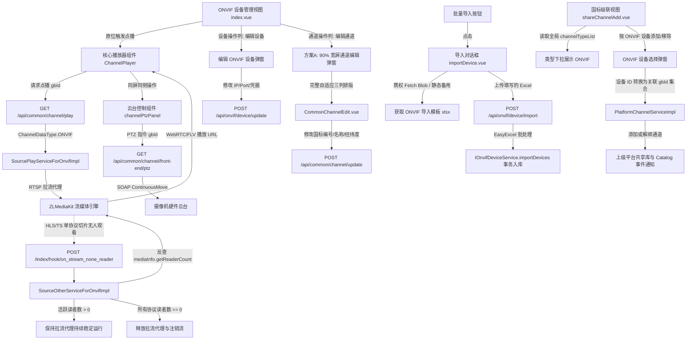

# ONVIF 接入调试问题深度解析与更新方案 (修订版)

本文档基于 `doc/reaticle_docs/onvif-implementation/phase-4-restful-api-and-web-ui.md` 规范及现场人工联调实测反馈，针对发现的点播报错跳转、云台遮挡画面、模板批量导入缺失与下载失败、ONVIF 国标编号配置与同步断链、国标级联无 ONVIF 选项、以及联调过程中暴露的 **播放 20 秒突然中断（HLS 无人观看误杀代理流）** 和 **通道编辑抽屉挤压排版看不全** 等关键问题进行系统解构与确定性架构升级。

---

## 1 Objectives (核心目标)

1. **重构点播与云台控制交互链路并保障长时播放稳定性**：
   - 根治点击“点播”跳转至 `/live` 并抛出 `TypeError: Cannot read properties of undefined (reading 'data')` 的问题；
   - 摒弃离开当前视图的路由跳转方式，改用原位弹窗模态播放器，视控同屏响应；
   - 消除 ZLMediaKit 多协议切片输出下，因未消费协议（如 HLS）触发 `on_stream_none_reader` 导致的拉流代理被误杀中断问题，实现点播流全生命周期的平稳长稳运行。
2. **构建高可用模板批量导入体系**：
   - 制定 ONVIF 摄像机设备 Excel 批量录入标准数据结构与模板规范（8大核心字段）；
   - 修复前端点击“下载导入模板”因缺失鉴权凭据引发 401 拦截的问题，改用携权 Blob 流式下载与静态备用文件双通道机制；
   - 交付前端拖拽解析上传与后端并发安全排队探测纳管能力。
3. **建立 ONVIF 设备与通道全生命周期精准编辑维护体系 (方案 A 落地)**：
   - **通道国标属性维护**：摒弃 700px 窄幅侧拉抽屉，采用 **90% 宽屏模态对话框** 挂载 `CommonChannelEdit.vue`，使三列网格表单完整自适应展开，彻底解决标签与输入框被压缩截断、排版错乱看不全的缺陷；
   - **设备基础信息维护**：在设备主表操作列补全“编辑”入口，实现设备名称、IP、端口、认证密码的即时修改，无缝联动后端 `/api/onvif/device/update`；
   - **同步与注销精准防重**：重构后端通道同步（`syncChannels`）与删除（`deleteDevice`）绑定机制，由脆弱的 `gbDeviceId` 匹配改为基于 `(data_type=4, data_device_id)` 复合物理主键定位，杜绝重复幽灵通道与注销残留。
4. **打通国标级联（GB/T 28181 Cascade）全链路**：
   - 修复前端全局通道类型枚举缺漏，使全局通道管理、级联通道库、录像计划及分组管理中均能准确识别与筛选 ONVIF 设备通道；
   - 扩展级联平台的“按设备添加”与“按设备移除”能力，支持按 ONVIF 物理设备直接将其所有码流通道批量注入或撤销上级平台共享库。

---

## 2 Constraints & Boundary Contract Matrix (约束条件与边界契约矩阵)

### 2.1 缺陷根因深度剖析

| 缺陷表现 | 物理发生位置 | 根因机理剖析 |
| :--- | :--- | :--- |
| **点播跳转报错** `TypeError: reading 'data'` | `views/onvif/index.vue:handlePlay` -> `views/live/index.vue` | 1. 视图层调用 `$router.push('/live?channelId=' + channel.gbDeviceId)` 强行切出页面；<br>2. `/live` 路由中调用底层接口要求传入自增整数主键 `CommonGBChannel.gbId`，而前端传入国标编码字符串（如 `340200...`），引发反序列化异常。 |
| **点播播放 20 秒后突然中断** | `SourceOtherServiceForOnvifImpl.java:closeStreamOnNoneReader` | ZLMediaKit 收流后同时生成 RTSP、RTMP、FLV、HLS 等切片。前端采用 `ws-flv` 或 `WebRTC` 播放，没有任何客户端拉取 HLS。达到 20 秒（`noneReaderDuration`）后，ZLM 触发 `on_stream_none_reader (schema=hls)`。服务端未校验全协议总活跃读者数（`mediaInfo.getReaderCount()`），直接强杀整个 RTSP 拉流代理，导致正常播放被掐断。 |
| **通道编辑抽屉排版拥挤看不全** | `web/src/views/onvif/index.vue` 与 `CommonChannelEdit.vue` | `CommonChannelEdit.vue` 内部采用三列网格布局（`grid-template-columns: 1fr 1fr 1fr`），且表单标签固定为 `160px`。在 `size="700px"` 的侧边抽屉中除去内边距后，每列宽度仅剩约 190px，输入框有效宽度不足 30px，导致字段全部被挤压遮蔽截断。 |
| **批量导入下载模板失败** | `views/onvif/dialog/importDevice.vue:handleDownloadTemplate` | 视图层使用 `window.open('/api/onvif/device/import/template', '_blank')` 发起 GET 请求。浏览器在新标签页打开时未附带 `access-token` 请求头，被 Spring Security 的 JWT 鉴权过滤器拦截返回 HTTP 401 报错。 |
| **国标编号不可修改与同步幽灵通道** | `views/onvif/index.vue` 与 `OnvifDeviceServiceImpl.java:syncChannels` | 1. **前端配置断链**：Profile 列表中仅纯文本展示国标编码，无维护入口；<br>2. **后端生成硬编码**：后端固定规则生成编码，不支持现场自定义；<br>3. **同步定位脆弱**：`syncChannels` 与 `deleteDevice` 依赖 `gbDeviceId` 查重。修改国标号后，旧编号无法命中引发重复插入，注销亦遗留孤儿数据。 |
| **国标级联无 ONVIF 选项与按设备映射失效** | `web/src/main.js:Vue.prototype.$channelTypeList` 与 `shareChannelAdd.vue` | 1. 全局配置仅定义类型 1、2、3、200，缺失 `4: ONVIF`，导致下拉列表过滤缺失；<br>2. “按设备添加/移除”针对 `data_device_id in (deviceIds)`，但 ONVIF 的 `data_device_id` 对应的是 `wvp_onvif_channel.id` 而非 `wvp_onvif_device.id`，映射链条断裂。 |

### 2.2 边界契约矩阵 (Boundary Contract Matrix)

```
+---------------------------------------------------------------------------------------------------+
|                                  WVP 核心对象标识符与交互协议契约                                   |
+---------------------+-------------------+------------------------+--------------------------------+
| 对象类型             | 字段名称          | 数据格式               | 语义契约与传递范围              |
+---------------------+-------------------+------------------------+--------------------------------+
| ONVIF 设备主键       | OnvifDevice.id    | Integer (自增主键)     | `wvp_onvif_device.id` 物理主键  |
| ONVIF 通道扩展主键   | OnvifChannel.id   | Integer (自增主键)     | `wvp_onvif_channel.id` 内部主键|
| WVP 核心通道主键     | CommonGBChannel   | Integer (gbId)         | `wvp_device_channel.id`，点播与|
|                     | .gbId             |                        | 云台 API 唯一合法参数           |
| 国标 20 位物理/虚拟码| gbDeviceId        | String(20)             | 上级级联信令、SIP 通信识别码    |
| 通道数据类型标识     | ChannelDataType   | Integer = 4            | 系统常量，标识为 ONVIF 类型     |
| 核心通道绑定外键     | dataDeviceId      | Integer                | 恒等于 `wvp_onvif_channel.id`  |
| RTSP 流媒体契约     | rtspUrl           | URI (带转义认证凭据)   | ZLMediaKit `addStreamProxy` 参数 |
+---------------------+-------------------+------------------------+--------------------------------+
```

1. **核心 API 契约**：
   - 点播拉流：`GET /api/common/channel/play?channelId={gbId}`（必选 `gbId`，类型 `Integer`）；
   - 云台操控：`GET /api/common/channel/front-end/ptz?channelId={gbId}&command={cmd}&panSpeed={ps}&tiltSpeed={ts}&zoomSpeed={zs}`（必选 `gbId`）；
   - 通道国标更新：`POST /api/common/channel/update`（必传 `gbId`，全字段增量差分更新）；
   - 设备信息更新：`POST /api/onvif/device/update`（传入 `OnvifDevice` 实体，变更 IP/端口/凭据自动重触发探针校验）；
   - 模板导出：`GET /api/onvif/device/import/template`（支持携带 `access-token` Header 或 Query 参数）。
2. **SQL 映射与别名防遮蔽契约**：
   - `OnvifChannelMapper.selectByDeviceId` 关联查询时，必须显式重命名，**严禁** `SELECT oc.*, dc.*` 导致 `dc.id` 覆盖 `oc.id`：
     ```sql
     SELECT 
         oc.*, 
         dc.id AS gb_id, 
         COALESCE(dc.gb_device_id, oc.gb_device_id) AS gb_device_id,
         COALESCE(dc.gb_name, oc.name) AS name
     FROM wvp_onvif_channel oc
     LEFT JOIN wvp_device_channel dc 
         ON dc.data_type = 4 AND dc.data_device_id = oc.id
     WHERE oc.device_id = #{deviceId}
     ORDER BY oc.channel_index ASC, oc.id ASC
     ```

---

## 3 Architecture (架构与模块分解)

### 3.1 总体逻辑流架构



### 3.2 模块分解设计

#### 3.2.1 模块 A：点播原位融合与无人观看误杀防御
- **流生命周期多协议防御 (`SourceOtherServiceForOnvifImpl.java`)**：
  - 拦截 `/on_stream_none_reader` Hook 时，调用 `mediaServerService.getMediaInfo(mediaServer, app, stream)` 查询当前流的全局状态；
  - 只要 `mediaInfo.getReaderCount() > 0`（表明当前尚有客户端通过 `ws-flv` 或 `WebRTC` 等观看），即使触发了 `schema=hls` 等单协议无人消费事件，坚决返回 `false`，绝不下发 `stopStream` 强杀代理；
  - 仅当全局活跃读者数清零（`readerCount == 0`）且按需拉流开启时，才统一释放流媒体资源。
- **原位视控同屏弹窗 (`web/src/views/onvif/index.vue`)**：
  - 引入通用设备播放器组件 `@/views/channel/player.vue` (`ChannelPlayer`)，点播时将 `channel.gbId` 与 `streamInfo` 传递至组件原位弹出；
  - 移除孤立的右侧抽屉 `ptzDrawerVisible` 与 `ptzController.vue`，同屏协同操控云台。

#### 3.2.2 模块 B：通道与设备编辑 UI 全面升级 (方案 A 落地)
- **通道国标属性编辑弹窗**：
  - 彻底废弃窄小局促的 700px 侧边抽屉，改用 `width="90%"`、`top="3vh"` 的全局模态对话框承载 `CommonChannelEdit.vue`；
  - 设置 `:destroy-on-close="true"` 与 `style="height: 72vh; overflow: auto;"`，使内置三列布局获得充足的物理展开空间（每列宽度 > 380px），标签与控件自适应对齐，零挤压截断。
- **设备基础属性编辑弹窗**：
  - 在主设备表格操作列增加“编辑”按钮，弹出 500px 标准对话框；
  - 支持直接修改设备名称、IP 地址、ONVIF 服务端口、用户名及密码，点击保存提交 `POST /api/onvif/device/update`，并在凭据或网络变动时自动重新探测校准。

#### 3.2.3 模块 C：标准 Excel 批量导入双通道下载保障
- **下载模板携权流式传输与静态容灾 (`importDevice.vue`)**：
  - 废弃 `window.open` 裸露调用，改用前端 `fetch(fileUrl, { headers: { 'access-token': getToken() } })` 携权机制并以 Blob 形式触发浏览器原生文件落地；
  - 在 `web/public/static/file/` 预编译打包合规的静态 `ONVIF设备批量导入模板.xlsx`，在界面提供直接下载备用链接；
  - 当动态接口发生偶发网络中断或鉴权异常时，自动无缝降级触发静态文件下载。

#### 3.2.4 模块 D：国标级联全链路支持
- **前端全局类型注册 (`web/src/main.js`)**：
  - 在 `Vue.prototype.$channelTypeList` 中注册 `4: { id: 4, name: 'ONVIF', style: { color: '#85ce61', borderColor: '#e1f3d8' } }`。
- **按设备批量级联添加与移除打通**：
  - 前端设计 `web/src/views/dialog/OnvifDeviceSelect.vue`，在 `shareChannelAdd.vue` 增加“按ONVIF设备添加/移除”；
  - 后端扩展 `PlatformChannelServiceImpl`，通过设备主键映射提取所有码流通道并批量上下架。

---

## 4 Work Breakdown Structure (工作分解结构 WBS)

| 阶段 | 编号 | 任务分类 | 涉及文件/组件 | 详细改造事项 |
| :--- | :--- | :--- | :--- | :--- |
| **P1** | 1.1 | 后端DAO/实体 | `com.genersoft.iot.vmp.onvif.bean.OnvifChannel` | 增加 `gbId` 属性，提供 Getter/Setter 及 Swagger 注解 |
| | 1.2 | 后端DAO/Mapper | `com.genersoft.iot.vmp.onvif.dao.OnvifChannelMapper` | 改造 `selectByDeviceId` SQL，LEFT JOIN `wvp_device_channel` 精准填充 `gb_id`、`gb_device_id`、`gb_name`，避免字段阴影覆盖 |
| | 1.3 | 后端服务层 | `com.genersoft.iot.vmp.onvif.service.impl.OnvifDeviceServiceImpl` | 重构 `syncChannels` 与 `deleteDevice`，改用 `(dataType=4, dataDeviceId)` 精准匹配核心通道，消除重复幽灵通道与注销残留 |
| | 1.4 | 前端播放与云台 | `web/src/views/onvif/index.vue` | 挂载 `ChannelPlayer` 组件；重写 `handlePlay` 调用原位播放器；在操作列聚合播放按钮；移除孤立云台抽屉 |
| **P2** | 2.1 | 导入 DTO | `com.genersoft.iot.vmp.onvif.dto.OnvifDeviceImportDto` | 定义 EasyExcel 属性注解，包含基本参数以及可选的“主通道国标编号”与“行政区划”列 |
| | 2.2 | 导入与维护接口 | `com.genersoft.iot.vmp.onvif.controller.OnvifDeviceController` | 增加 `/import/template`（模板导出）、`/import`（文件上传解析）以及 `/update`（设备信息编辑）接口 |
| | 2.3 | 导入服务层 | `com.genersoft.iot.vmp.onvif.service.IOnvifDeviceService` | 实现批量循环导入、并发安全探针、自定义国标号绑定与错误汇总包装逻辑 |
| **P3** | 3.1 | 前端全局配置 | `web/src/main.js` | 在 `Vue.prototype.$channelTypeList` 中注册 `id: 4 (ONVIF)` |
| | 3.2 | 级联视图优化 | `web/src/views/platform/dialog/shareChannelAdd.vue` | 引入 ONVIF 设备选择弹窗，支持按 ONVIF 物理设备一键批量圈选入库或批量移除 |
| | 3.3 | 级联服务层 | `com.genersoft.iot.vmp.gb28181.service.impl.PlatformChannelServiceImpl` | 扩展 `addChannelByDevice` 与 `removeChannelByDevice`，通过 `onvifChannel.id` 关联 `gbId` 执行级联上下架 |
| **P4** | 4.1 | 流生命周期修复 | `com.genersoft.iot.vmp.onvif.service.impl.SourceOtherServiceForOnvifImpl` | 增加全协议读者状态核查，彻底解决 HLS 单切片无人观看导致的 20s 代理误杀问题 |
| | 4.2 | 通道/设备编辑UI | `web/src/views/onvif/index.vue` | **落地方案 A**：改用 90% 宽屏弹窗完整展示通道编辑三列网格；并在设备操作列增加设备基础信息编辑弹窗 |
| | 4.3 | 模板下载双通道 | `web/src/views/onvif/dialog/importDevice.vue` 与静态文件 | 修复 `window.open` 缺失鉴权的问题，实现携带 JWT Token 的 Blob 下载，并提供静态备用模板兜底 |

---

## 5 Acceptance Criteria (验收门禁标准)

### 5.1 点播与长时播放稳定性验收标准
1. **原位播放与同屏视控**：
   - 在 ONVIF 设备列表主表或展开 Profile 列表点击“播放”，页面不发生路由跳转，屏幕居中弹出视频播放窗口；
   - 视频窗口右侧同屏展示云台控制盘与变倍控制，操控方向与刹车响应即时流畅。
2. **长效播放无中断误杀**：
   - 连续点播观看码流 5 分钟以上，画面持续流畅出流，浏览器控制台无断流报错；
   - 后台 ZLMediaKit 产生 `on_stream_none_reader (schema=hls)` 回调时，服务端正确判定 `readerCount > 0` 并放行，拉流代理绝不被提前释放。

### 5.2 通道与设备编辑 UI 验收标准 (方案 A)
1. **通道国标属性完整展示**：
   - 点击 Profile 列表中的“编辑”按钮，屏幕中央弹出 `90%` 宽度的标准对话框；
   - 通道编辑表单的三列（基本信息、业务/网络、位置与补光）完整展开并对齐，所有输入框、选择器及面包屑路径清晰可读，无任何挤压截断现象；
   - 修改自定义国标编号并保存后，主界面列表即时同步刷新，后台数据无重复幽灵通道。
2. **设备基础信息原位维护**：
   - 点击设备主表操作列的“编辑”按钮，弹出设备配置模态框；
   - 修改设备名称、IP、端口或密码并保存，数据持久化成功，网络变动时自动重新建立连接探测。

### 5.3 批量导入高可用验收标准
1. **模板携权与容灾下载**：
   - 点击“下载导入模板 (.xlsx)”，系统在当前页面流式拉取并自动弹出文件保存对话框，下载文件内容完整可用；
   - 点击“直接下载静态备用模板”，无需经由动态接口直接瞬时获取静态备份文件。
2. **批量解析与容错录入**：
   - 上传表格文件，系统并发安全探测纳管，指定国标编号的通道准确注册，遇到异常行时清晰跳过并展示明细错误日志清单。

### 5.4 国标级联全链路验收标准
1. **类型识别与条件筛选**：
   - 级联共享通道添加页面的“类型”下拉框中可见 `ONVIF`，过滤后准确展示纳管的 ONVIF 码流通道，标签带绿底标识。
2. **按设备一键上下架**：
   - 支持按 ONVIF 物理设备一键批量圈选入库或批量移除，上级平台即时收到 Catalog 目录通知并能正常拉流推流。
