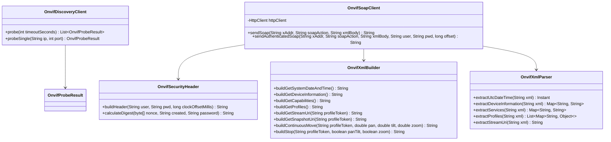

# 第一阶段实施细节：通信引擎底座与 WS-Discovery 探测器

## 1 阶段概述与技术定位

本阶段是 WVP-PRO 支持 ONVIF 协议的底座基石。核心目标是构建一个**轻量、健壮、零新增外部依赖（Zero-New-Dependency）**的底层通信框架，包含：
1. **WS-Discovery 网络搜寻客户端**：支持局域网 UDP 多播探测与单播直接探测，自动发现局域网内的摄像机及其 `device_service` 地址；
2. **时钟偏斜（Clock Skew）自动测算与补偿**：通过无鉴权获取摄像机 UTC 硬件时间，消除设备时钟不准导致的 401 Unauthorized 鉴权失败；
3. **WS-Security UsernameToken 签名引擎**：生成符合 OASIS WS-Security 1.1 规范的 PasswordDigest 签名；
4. **轻量预编译 XML 模板工厂**：装配 ONVIF 标准信令，避免重量级 SOAP 框架的反射与复杂内存开销；
5. **宽容型 XML 响应解析器**：基于 `dom4j` 实现忽略命名空间前缀、忽略大小写差异的宽容抽取机制，抵抗安防厂商老旧固件非标响应；
6. **JDK 21 原生 HttpClient 通信驱动**：天然适配 Spring Boot 3.4+ 虚拟线程池，支持毫秒级超时与高并发信令交互。

---

## 2 代码清单与类图结构

本阶段交付物全部位于 `src/main/java/com/genersoft/iot/vmp/onvif/` 模块下：

```text
com.genersoft.iot.vmp.onvif/
├── bean/
│   └── OnvifProbeResult.java             # WS-Discovery 搜寻发现结果实体
└── client/
    ├── OnvifSecurityHeader.java          # WS-Security 签名与动态时钟补偿器
    ├── OnvifXmlBuilder.java              # 预编译 SOAP XML 模板工厂
    ├── OnvifXmlParser.java               # 基于 dom4j 的宽容型 XML 响应抽取器
    ├── OnvifSoapClient.java              # 基于 JDK 21 HttpClient 的 SOAP 传输核心
    └── OnvifDiscoveryClient.java         # WS-Discovery UDP 多播/单播探测引擎
```



---

## 3 详细实现与源码设计

### 3.1 搜寻发现实体 `OnvifProbeResult.java`

用于承载 WS-Discovery 探测阶段摄像机回传的物理与网络元数据。

```java
// src/main/java/com/genersoft/iot/vmp/onvif/bean/OnvifProbeResult.java
package com.genersoft.iot.vmp.onvif.bean;

import lombok.Data;
import lombok.NoArgsConstructor;
import lombok.AllArgsConstructor;
import lombok.Builder;

import java.util.List;

/**
 * WS-Discovery 搜寻发现结果实体
 */
@Data
@Builder
@NoArgsConstructor
@AllArgsConstructor
public class OnvifProbeResult {

    /** 设备 IP 地址 */
    private String ip;

    /** ONVIF 服务端口号 (通常为 80, 8080, 8899) */
    private int port;

    /** 设备服务 XAddr 地址 (如 http://192.168.1.108/onvif/device_service) */
    private String deviceServiceUrl;

    /** 设备全球唯一 Endpoint UUID */
    private String endpointReference;

    /** 类型标识列表 (如 dn:NetworkVideoTransmitter) */
    private List<String> types;

    /** 厂商名称 (从 Scopes 中解析，如 Hikvision, Dahua) */
    private String manufacturer;

    /** 设备型号 (从 Scopes 中解析) */
    private String model;

    /** 硬件名称或位置信息 (从 Scopes 中解析) */
    private String name;

    /** 原始 Scopes 集合 */
    private List<String> scopes;
}
```

---

### 3.2 动态时钟补偿与 WS-Security 签名 `OnvifSecurityHeader.java`

**关键算法契约**：
1. **Nonce 随机字节**：严格采用 `java.security.SecureRandom` 生成 16 字节随机字节序列；
2. **时间戳校准**：$T_{\text{created}} = \text{Instant.now().plusMillis}(\text{clockOffsetMillis})$，以 ISO-8601 UTC 格式输出（精确到秒，形如 `2026-09-08T09:45:00Z`）；
3. **Digest 生成逻辑**：
   $$\text{PasswordDigest} = \text{Base64}\Big(\text{SHA-1}\big(\text{Nonce}_{\text{raw}} + T_{\text{created\_bytes}} + \text{Password}_{\text{bytes}}\big)\Big)$$

```java
// src/main/java/com/genersoft/iot/vmp/onvif/client/OnvifSecurityHeader.java
package com.genersoft.iot.vmp.onvif.client;

import lombok.extern.slf4j.Slf4j;

import java.nio.charset.StandardCharsets;
import java.security.MessageDigest;
import java.security.NoSuchAlgorithmException;
import java.security.SecureRandom;
import java.time.Instant;
import java.time.temporal.ChronoUnit;
import java.util.Base64;

/**
 * WS-Security UsernameToken 签名生成器 (集成时钟偏差自动补偿)
 */
@Slf4j
public class OnvifSecurityHeader {

    private static final SecureRandom SECURE_RANDOM = new SecureRandom();

    /**
     * 构建包含 WS-Security 的 SOAP Header 节点片段
     *
     * @param username          ONVIF 用户名
     * @param password          ONVIF 密码
     * @param clockOffsetMillis 本地与摄像机的时钟偏差(毫秒): CameraTime - LocalTime
     * @return SOAP Header XML 节点字符串
     */
    public static String buildHeader(String username, String password, long clockOffsetMillis) {
        if (username == null || username.trim().isEmpty() || password == null) {
            return "<s:Header/>";
        }

        // 1. 生成 16 字节真随机数
        byte[] nonceRaw = new byte[16];
        SECURE_RANDOM.nextBytes(nonceRaw);
        String nonceBase64 = Base64.getEncoder().encodeToString(nonceRaw);

        // 2. 计算补偿后的 UTC 时间戳
        Instant cameraAdjustedTime = Instant.now().plusMillis(clockOffsetMillis).truncatedTo(ChronoUnit.SECONDS);
        String created = cameraAdjustedTime.toString();

        // 3. 计算 PasswordDigest
        String passwordDigest = calculatePasswordDigest(nonceRaw, created, password);

        // 4. 组装 WS-Security XML
        return String.format(
            "<s:Header>\n" +
            "  <wsse:Security xmlns:wsse=\"http://docs.oasis-open.org/wss/2004/01/oasis-200401-wss-wssecurity-secext-1.0.xsd\" " +
            "xmlns:wsu=\"http://docs.oasis-open.org/wss/2004/01/oasis-200401-wss-wssecurity-utility-1.0.xsd\">\n" +
            "    <wsse:UsernameToken>\n" +
            "      <wsse:Username>%s</wsse:Username>\n" +
            "      <wsse:Password Type=\"http://docs.oasis-open.org/wss/2004/01/oasis-200401-wss-username-token-profile-1.0#PasswordDigest\">%s</wsse:Password>\n" +
            "      <wsse:Nonce EncodingType=\"http://docs.oasis-open.org/wss/2004/01/oasis-200401-wss-soap-message-security-1.0#Base64Binary\">%s</wsse:Nonce>\n" +
            "      <wsu:Created>%s</wsu:Created>\n" +
            "    </wsse:UsernameToken>\n" +
            "  </wsse:Security>\n" +
            "</s:Header>",
            username, passwordDigest, nonceBase64, created
        );
    }

    /**
     * PasswordDigest = Base64(SHA-1(NonceRaw + CreatedUtf8 + PasswordUtf8))
     */
    public static String calculatePasswordDigest(byte[] nonceRaw, String created, String password) {
        try {
            MessageDigest sha1 = MessageDigest.getInstance("SHA-1");
            sha1.update(nonceRaw);
            sha1.update(created.getBytes(StandardCharsets.UTF_8));
            sha1.update(password.getBytes(StandardCharsets.UTF_8));
            byte[] digest = sha1.digest();
            return Base64.getEncoder().encodeToString(digest);
        } catch (NoSuchAlgorithmException e) {
            log.error("[ONVIF-Security] SHA-1 算法不可用", e);
            throw new RuntimeException("SHA-1 algorithm not available", e);
        }
    }
}
```

---

### 3.3 预编译 XML 模板工厂 `OnvifXmlBuilder.java`

装配信令时，统一将 Header 与 Body 嵌入标准 SOAP 1.2 / SOAP 1.1 Envelope。

```java
// src/main/java/com/genersoft/iot/vmp/onvif/client/OnvifXmlBuilder.java
package com.genersoft.iot.vmp.onvif.client;

import java.util.Locale;

/**
 * 预编译 SOAP XML 报文组装工厂
 */
public class OnvifXmlBuilder {

    private static final String ENVELOPE_TEMPLATE =
            "<?xml version=\"1.0\" encoding=\"utf-8\"?>\n" +
            "<s:Envelope xmlns:s=\"http://www.w3.org/2003/05/soap-envelope\" " +
            "xmlns:tds=\"http://www.onvif.org/ver10/device/wsdl\" " +
            "xmlns:trt=\"http://www.onvif.org/ver10/media/wsdl\" " +
            "xmlns:tptz=\"http://www.onvif.org/ver20/ptz/wsdl\" " +
            "xmlns:tt=\"http://www.onvif.org/ver10/schema\">\n" +
            "  %s\n" +
            "  <s:Body>\n" +
            "    %s\n" +
            "  </s:Body>\n" +
            "</s:Envelope>";

    public static String wrapEnvelope(String headerXml, String bodyXml) {
        String safeHeader = (headerXml != null && !headerXml.trim().isEmpty()) ? headerXml : "<s:Header/>";
        return String.format(ENVELOPE_TEMPLATE, safeHeader, bodyXml);
    }

    /** 1. 获取设备系统时间 (无鉴权接口) */
    public static String buildGetSystemDateAndTime() {
        return wrapEnvelope("<s:Header/>", "<tds:GetSystemDateAndTime/>");
    }

    /** 2. 获取设备硬件信息 (需要鉴权) */
    public static String buildGetDeviceInformation(String headerXml) {
        return wrapEnvelope(headerXml, "<tds:GetDeviceInformation/>");
    }

    /** 3. 获取设备服务能力集 (Capabilities) */
    public static String buildGetCapabilities(String headerXml) {
        return wrapEnvelope(headerXml,
                "<tds:GetCapabilities>\n" +
                "  <tds:Category>All</tds:Category>\n" +
                "</tds:GetCapabilities>");
    }

    /** 4. 获取所有媒体 Profile 列表 */
    public static String buildGetProfiles(String headerXml) {
        return wrapEnvelope(headerXml, "<trt:GetProfiles/>");
    }

    /** 5. 获取指定 Profile 的 RTSP 流地址 */
    public static String buildGetStreamUri(String headerXml, String profileToken) {
        return wrapEnvelope(headerXml,
                String.format(
                    "<trt:GetStreamUri>\n" +
                    "  <trt:StreamSetup>\n" +
                    "    <tt:Stream>RTP-Unicast</tt:Stream>\n" +
                    "    <tt:Transport>\n" +
                    "      <tt:Protocol>RTSP</tt:Protocol>\n" +
                    "    </tt:Transport>\n" +
                    "  </trt:StreamSetup>\n" +
                    "  <trt:ProfileToken>%s</trt:ProfileToken>\n" +
                    "</trt:GetStreamUri>",
                    profileToken
                ));
    }

    /** 6. 获取抓拍快照 Snapshot 地址 */
    public static String buildGetSnapshotUri(String headerXml, String profileToken) {
        return wrapEnvelope(headerXml,
                String.format(
                    "<trt:GetSnapshotUri>\n" +
                    "  <trt:ProfileToken>%s</trt:ProfileToken>\n" +
                    "</trt:GetSnapshotUri>",
                    profileToken
                ));
    }

    /** 7. 云台平滑转动与变倍控制 (ContinuousMove) */
    public static String buildContinuousMove(String headerXml, String profileToken, double pan, double tilt, double zoom) {
        return wrapEnvelope(headerXml,
                String.format(Locale.US,
                    "<tptz:ContinuousMove>\n" +
                    "  <tptz:ProfileToken>%s</tptz:ProfileToken>\n" +
                    "  <tptz:Velocity>\n" +
                    "    <tt:PanTilt x=\"%.3f\" y=\"%.3f\" space=\"http://www.onvif.org/ver10/tptz/PanTiltSpaces/VelocityGenericSpace\"/>\n" +
                    "    <tt:Zoom x=\"%.3f\" space=\"http://www.onvif.org/ver10/tptz/ZoomSpaces/VelocityGenericSpace\"/>\n" +
                    "  </tptz:Velocity>\n" +
                    "</tptz:ContinuousMove>",
                    profileToken, pan, tilt, zoom
                ));
    }

    /** 8. 云台立即停止 (Stop) */
    public static String buildStop(String headerXml, String profileToken, boolean panTilt, boolean zoom) {
        return wrapEnvelope(headerXml,
                String.format(
                    "<tptz:Stop>\n" +
                    "  <tptz:ProfileToken>%s</tptz:ProfileToken>\n" +
                    "  <tptz:PanTilt>%s</tptz:PanTilt>\n" +
                    "  <tptz:Zoom>%s</tptz:Zoom>\n" +
                    "</tptz:Stop>",
                    profileToken, panTilt, zoom
                ));
    }

    /** 9. 查询预置位列表 */
    public static String buildGetPresets(String headerXml, String profileToken) {
        return wrapEnvelope(headerXml,
                String.format("<tptz:GetPresets><tptz:ProfileToken>%s</tptz:ProfileToken></tptz:GetPresets>", profileToken));
    }

    /** 10. 调用指定预置位 */
    public static String buildGotoPreset(String headerXml, String profileToken, String presetToken) {
        return wrapEnvelope(headerXml,
                String.format(
                    "<tptz:GotoPreset>\n" +
                    "  <tptz:ProfileToken>%s</tptz:ProfileToken>\n" +
                    "  <tptz:PresetToken>%s</tptz:PresetToken>\n" +
                    "</tptz:GotoPreset>",
                    profileToken, presetToken
                ));
    }
}
```

---

### 3.4 宽容型 XML 响应解析器 `OnvifXmlParser.java`

利用 `dom4j` 解析，采用忽略前缀的 XPath/递归节点搜索机制，彻底免疫非标 XML 命名空间问题。

```java
// src/main/java/com/genersoft/iot/vmp/onvif/client/OnvifXmlParser.java
package com.genersoft.iot.vmp.onvif.client;

import lombok.extern.slf4j.Slf4j;
import org.dom4j.Document;
import org.dom4j.DocumentHelper;
import org.dom4j.Element;

import java.time.Instant;
import java.time.LocalDateTime;
import java.time.ZoneOffset;
import java.util.*;

/**
 * 基于 dom4j 的宽容型 XML 响应抽取器 (忽略命名空间前缀与多层包裹)
 */
@Slf4j
public class OnvifXmlParser {

    /** 递归查找指定名称的第一个子节点 (忽略大小写与命名空间前缀) */
    public static Element findElementIgnoreCase(Element root, String targetName) {
        if (root == null) return null;
        if (root.getName().equalsIgnoreCase(targetName)) {
            return root;
        }
        for (Element child : root.elements()) {
            Element found = findElementIgnoreCase(child, targetName);
            if (found != null) {
                return found;
            }
        }
        return null;
    }

    /** 递归查找指定名称的所有子节点 (忽略大小写与命名空间前缀) */
    public static List<Element> findElementsIgnoreCase(Element root, String targetName) {
        List<Element> result = new ArrayList<>();
        if (root == null) return result;
        collectElements(root, targetName, result);
        return result;
    }

    private static void collectElements(Element current, String targetName, List<Element> collector) {
        if (current.getName().equalsIgnoreCase(targetName)) {
            collector.add(current);
        }
        for (Element child : current.elements()) {
            collectElements(child, targetName, collector);
        }
    }

    /** 提取摄像机 UTC 硬件时间戳 */
    public static Instant parseSystemDateTime(String xml) {
        try {
            Document doc = DocumentHelper.parseText(xml);
            Element utcDateTime = findElementIgnoreCase(doc.getRootElement(), "UTCDateTime");
            if (utcDateTime == null) {
                log.warn("[ONVIF-Parser] 未在响应中找到 UTCDateTime 节点");
                return Instant.now();
            }

            Element timeElem = findElementIgnoreCase(utcDateTime, "Time");
            Element dateElem = findElementIgnoreCase(utcDateTime, "Date");

            int hour = Integer.parseInt(Objects.requireNonNull(findElementIgnoreCase(timeElem, "Hour")).getTextTrim());
            int minute = Integer.parseInt(Objects.requireNonNull(findElementIgnoreCase(timeElem, "Minute")).getTextTrim());
            int second = Integer.parseInt(Objects.requireNonNull(findElementIgnoreCase(timeElem, "Second")).getTextTrim());

            int year = Integer.parseInt(Objects.requireNonNull(findElementIgnoreCase(dateElem, "Year")).getTextTrim());
            int month = Integer.parseInt(Objects.requireNonNull(findElementIgnoreCase(dateElem, "Month")).getTextTrim());
            int day = Integer.parseInt(Objects.requireNonNull(findElementIgnoreCase(dateElem, "Day")).getTextTrim());

            return LocalDateTime.of(year, month, day, hour, minute, second).toInstant(ZoneOffset.UTC);
        } catch (Exception e) {
            log.error("[ONVIF-Parser] 解析 SystemDateTime 失败，降级使用本机时钟: {}", e.getMessage());
            return Instant.now();
        }
    }

    /** 提取设备硬件信息 (Manufacturer, Model, FirmwareVersion, SerialNumber) */
    public static Map<String, String> parseDeviceInformation(String xml) {
        Map<String, String> info = new HashMap<>();
        try {
            Document doc = DocumentHelper.parseText(xml);
            Element root = doc.getRootElement();
            extractText(root, "Manufacturer", info, "manufacturer");
            extractText(root, "Model", info, "model");
            extractText(root, "FirmwareVersion", info, "firmwareVersion");
            extractText(root, "SerialNumber", info, "serialNumber");
            extractText(root, "HardwareId", info, "hardwareId");
        } catch (Exception e) {
            log.error("[ONVIF-Parser] 解析 DeviceInformation 失败: {}", e.getMessage());
        }
        return info;
    }

    /** 提取服务能力 URL (Media XAddr, PTZ XAddr, Imaging XAddr) */
    public static Map<String, String> parseCapabilities(String xml) {
        Map<String, String> services = new HashMap<>();
        try {
            Document doc = DocumentHelper.parseText(xml);
            Element root = doc.getRootElement();

            Element media = findElementIgnoreCase(root, "Media");
            if (media != null) {
                Element xAddr = findElementIgnoreCase(media, "XAddr");
                if (xAddr != null) services.put("mediaUrl", xAddr.getTextTrim());
            }

            Element ptz = findElementIgnoreCase(root, "PTZ");
            if (ptz != null) {
                Element xAddr = findElementIgnoreCase(ptz, "XAddr");
                if (xAddr != null) services.put("ptzUrl", xAddr.getTextTrim());
            }

            Element imaging = findElementIgnoreCase(root, "Imaging");
            if (imaging != null) {
                Element xAddr = findElementIgnoreCase(imaging, "XAddr");
                if (xAddr != null) services.put("imagingUrl", xAddr.getTextTrim());
            }
        } catch (Exception e) {
            log.error("[ONVIF-Parser] 解析 Capabilities 失败: {}", e.getMessage());
        }
        return services;
    }

    /** 提取 RTSP Stream URI */
    public static String parseStreamUri(String xml) {
        try {
            Document doc = DocumentHelper.parseText(xml);
            Element uriElem = findElementIgnoreCase(doc.getRootElement(), "Uri");
            if (uriElem != null) {
                return uriElem.getTextTrim();
            }
        } catch (Exception e) {
            log.error("[ONVIF-Parser] 解析 StreamUri 失败: {}", e.getMessage());
        }
        return null;
    }

    private static void extractText(Element root, String tag, Map<String, String> map, String key) {
        Element elem = findElementIgnoreCase(root, tag);
        if (elem != null) {
            map.put(key, elem.getTextTrim());
        }
    }
}
```

---

### 3.5 原生 HttpClient SOAP 核心客户端 `OnvifSoapClient.java`

基于 Java 21 `java.net.http.HttpClient`，支持超时设置、重试与虚拟线程池并发执行。

```java
// src/main/java/com/genersoft/iot/vmp/onvif/client/OnvifSoapClient.java
package com.genersoft.iot.vmp.onvif.client;

import lombok.extern.slf4j.Slf4j;
import org.springframework.stereotype.Component;

import java.net.URI;
import java.net.http.HttpClient;
import java.net.http.HttpRequest;
import java.net.http.HttpResponse;
import java.time.Duration;

/**
 * 基于 JDK 21 原生 HttpClient 的 SOAP 传输核心客户端
 */
@Slf4j
@Component
public class OnvifSoapClient {

    private final HttpClient httpClient;

    public OnvifSoapClient() {
        // 创建原生 HttpClient，设置 5 秒连接超时
        this.httpClient = HttpClient.newBuilder()
                .version(HttpClient.Version.HTTP_1_1)
                .connectTimeout(Duration.ofSeconds(5))
                .followRedirects(HttpClient.Redirect.NORMAL)
                .build();
    }

    /**
     * 发送无认证免签 SOAP 请求 (用于 GetSystemDateAndTime)
     */
    public String sendSoap(String serviceUrl, String soapAction, String xmlBody) throws Exception {
        return executePost(serviceUrl, soapAction, xmlBody);
    }

    /**
     * 发送带 WS-Security 签名的 SOAP 请求 (自动注入时钟补偿)
     */
    public String sendAuthenticatedSoap(String serviceUrl, String soapAction, String innerBodyXml,
                                        String username, String password, long clockOffsetMillis) throws Exception {
        String headerXml = OnvifSecurityHeader.buildHeader(username, password, clockOffsetMillis);
        String fullEnvelope = OnvifXmlBuilder.wrapEnvelope(headerXml, innerBodyXml);
        return executePost(serviceUrl, soapAction, fullEnvelope);
    }

    private String executePost(String serviceUrl, String soapAction, String xml) throws Exception {
        HttpRequest.Builder builder = HttpRequest.newBuilder()
                .uri(URI.create(serviceUrl))
                .timeout(Duration.ofSeconds(6))
                .header("Content-Type", "application/soap+xml; charset=utf-8")
                .header("Accept", "application/soap+xml, multipart/related, text/html, image/jpeg, *; q=.2")
                .header("User-Agent", "WVP-PRO/2.7.4 (ONVIF Client)")
                .POST(HttpRequest.BodyPublishers.ofString(xml));

        if (soapAction != null && !soapAction.trim().isEmpty()) {
            builder.header("SOAPAction", soapAction);
        }

        HttpRequest request = builder.build();
        HttpResponse<String> response = httpClient.send(request, HttpResponse.BodyHandlers.ofString());

        int statusCode = response.statusCode();
        if (statusCode == 200) {
            return response.body();
        } else if (statusCode == 401) {
            log.warn("[ONVIF-SOAP] 请求未授权 401 Unauthorized: url={}", serviceUrl);
            throw new RuntimeException("401 Unauthorized: 密码错误或时钟偏斜超限");
        } else {
            log.warn("[ONVIF-SOAP] 请求异常 HTTP {}: url={}, body={}", statusCode, serviceUrl, response.body());
            throw new RuntimeException("HTTP " + statusCode + ": " + response.body());
        }
    }
}
```

---

### 3.6 WS-Discovery 网络搜寻引擎 `OnvifDiscoveryClient.java`

支持多网卡多播探测与针对已知网段/IP 的单播探测。

```java
// src/main/java/com/genersoft/iot/vmp/onvif/client/OnvifDiscoveryClient.java
package com.genersoft.iot.vmp.onvif.client;

import com.genersoft.iot.vmp.onvif.bean.OnvifProbeResult;
import lombok.extern.slf4j.Slf4j;
import org.dom4j.Document;
import org.dom4j.DocumentHelper;
import org.dom4j.Element;
import org.springframework.stereotype.Component;

import java.net.*;
import java.nio.charset.StandardCharsets;
import java.util.*;
import java.util.concurrent.*;

/**
 * WS-Discovery 局域网 UDP 探测与单播搜寻器
 */
@Slf4j
@Component
public class OnvifDiscoveryClient {

    private static final String MULTICAST_ADDRESS = "239.255.255.250";
    private static final int WS_DISCOVERY_PORT = 3702;

    private static final String PROBE_TEMPLATE =
            "<?xml version=\"1.0\" encoding=\"utf-8\"?>\n" +
            "<Envelope xmlns:dn=\"http://www.onvif.org/ver10/network/wsdl\"\n" +
            "          xmlns=\"http://www.w3.org/2003/05/soap-envelope\">\n" +
            "  <Header>\n" +
            "    <wsa:MessageID xmlns:wsa=\"http://schemas.xmlsoap.org/ws/2004/08/addressing\">uuid:%s</wsa:MessageID>\n" +
            "    <wsa:To xmlns:wsa=\"http://schemas.xmlsoap.org/ws/2004/08/addressing\">urn:schemas-xmlsoap-org:ws:2005:04:discovery</wsa:To>\n" +
            "    <wsa:Action xmlns:wsa=\"http://schemas.xmlsoap.org/ws/2004/08/addressing\">http://schemas.xmlsoap.org/ws/2005:04:discovery/Probe</wsa:Action>\n" +
            "  </Header>\n" +
            "  <Body>\n" +
            "    <Probe xmlns=\"http://schemas.xmlsoap.org/ws/2005/04/discovery\">\n" +
            "      <Types>dn:NetworkVideoTransmitter</Types>\n" +
            "    </Probe>\n" +
            "  </Body>\n" +
            "</Envelope>";

    /**
     * 发起局域网多播探测 (收集全部响应)
     *
     * @param timeoutSeconds 接收回包的窗口秒数 (推荐 2.5 ~ 3.0 秒)
     * @return 探测到的 ONVIF 设备列表
     */
    public List<OnvifProbeResult> probe(int timeoutSeconds) {
        Map<String, OnvifProbeResult> resultMap = new ConcurrentHashMap<>();
        String messageId = UUID.randomUUID().toString();
        String probeMessage = String.format(PROBE_TEMPLATE, messageId);
        byte[] sendData = probeMessage.getBytes(StandardCharsets.UTF_8);

        try (DatagramSocket socket = new DatagramSocket()) {
            socket.setBroadcast(true);
            socket.setSoTimeout(1000);

            InetAddress group = InetAddress.getByName(MULTICAST_ADDRESS);
            DatagramPacket packet = new DatagramPacket(sendData, sendData.length, group, WS_DISCOVERY_PORT);
            socket.send(packet);
            log.info("[WS-Discovery] 多播探测已发送至 {}:{}, 监听时长: {}s", MULTICAST_ADDRESS, WS_DISCOVERY_PORT, timeoutSeconds);

            long deadline = System.currentTimeMillis() + (timeoutSeconds * 1000L);
            byte[] buf = new byte[8192];

            while (System.currentTimeMillis() < deadline) {
                try {
                    DatagramPacket receivePacket = new DatagramPacket(buf, buf.length);
                    socket.receive(receivePacket);
                    String responseXml = new String(receivePacket.getData(), 0, receivePacket.getLength(), StandardCharsets.UTF_8);
                    parseProbeMatch(responseXml, receivePacket.getAddress().getHostAddress(), resultMap);
                } catch (SocketTimeoutException ignored) {
                    // 超时等待下一个数据包
                }
            }
        } catch (Exception e) {
            log.error("[WS-Discovery] 发起多播搜寻异常: {}", e.getMessage(), e);
        }

        return new ArrayList<>(resultMap.values());
    }

    /**
     * 单播探测指定 IP:Port
     */
    public OnvifProbeResult probeSingle(String ip, int port) {
        String messageId = UUID.randomUUID().toString();
        String probeMessage = String.format(PROBE_TEMPLATE, messageId);
        byte[] sendData = probeMessage.getBytes(StandardCharsets.UTF_8);

        try (DatagramSocket socket = new DatagramSocket()) {
            socket.setSoTimeout(2500);
            InetAddress target = InetAddress.getByName(ip);
            DatagramPacket packet = new DatagramPacket(sendData, sendData.length, target, port);
            socket.send(packet);

            byte[] buf = new byte[8192];
            DatagramPacket receivePacket = new DatagramPacket(buf, buf.length);
            socket.receive(receivePacket);

            String responseXml = new String(receivePacket.getData(), 0, receivePacket.getLength(), StandardCharsets.UTF_8);
            Map<String, OnvifProbeResult> map = new HashMap<>();
            parseProbeMatch(responseXml, ip, map);
            return map.isEmpty() ? null : map.values().iterator().next();
        } catch (Exception e) {
            log.warn("[WS-Discovery] 单播探测失败 {}:{}: {}", ip, port, e.getMessage());
            return null;
        }
    }

    private void parseProbeMatch(String xml, String senderIp, Map<String, OnvifProbeResult> collector) {
        try {
            Document doc = DocumentHelper.parseText(xml);
            List<Element> matches = OnvifXmlParser.findElementsIgnoreCase(doc.getRootElement(), "ProbeMatch");
            for (Element match : matches) {
                Element xAddrsElem = OnvifXmlParser.findElementIgnoreCase(match, "XAddrs");
                if (xAddrsElem == null) continue;

                String xAddrs = xAddrsElem.getTextTrim();
                String[] urlList = xAddrs.split("\\s+");
                for (String url : urlList) {
                    if (url.startsWith("http://") || url.startsWith("https://")) {
                        URI uri = URI.create(url);
                        String host = uri.getHost();
                        int port = uri.getPort() == -1 ? 80 : uri.getPort();

                        Element scopesElem = OnvifXmlParser.findElementIgnoreCase(match, "Scopes");
                        List<String> scopeList = new ArrayList<>();
                        String manufacturer = "Generic";
                        String model = "IPC";
                        String name = host;

                        if (scopesElem != null) {
                            String[] scopes = scopesElem.getTextTrim().split("\\s+");
                            scopeList.addAll(Arrays.asList(scopes));
                            for (String s : scopes) {
                                if (s.contains("/hardware/")) {
                                    model = s.substring(s.lastIndexOf('/') + 1);
                                } else if (s.contains("/name/")) {
                                    name = URLDecoder.decode(s.substring(s.lastIndexOf('/') + 1), StandardCharsets.UTF_8);
                                } else if (s.contains("/mfr/") || s.contains("/manufacturer/")) {
                                    manufacturer = s.substring(s.lastIndexOf('/') + 1);
                                }
                            }
                        }

                        String key = host + ":" + port;
                        collector.put(key, OnvifProbeResult.builder()
                                .ip(host)
                                .port(port)
                                .deviceServiceUrl(url)
                                .manufacturer(manufacturer)
                                .model(model)
                                .name(name)
                                .scopes(scopeList)
                                .build());
                    }
                }
            }
        } catch (Exception e) {
            log.error("[WS-Discovery] 解析 ProbeMatches 报文异常: {}", e.getMessage());
        }
    }
}
```

---

## 4 阶段验收门禁标准

1. **零新增依赖**：运行 `mvn dependency:tree -Dincludes=org.apache.cxf:*,org.glassfish.metro:*`，输出为空，编译通过；
2. **时钟偏差自愈**：模拟摄像头 RTC 时钟快 2 小时或慢 1 小时，`OnvifSecurityHeader` 计算的 `wsu:Created` 时间戳与摄像头本地时间保持在 $\pm 5$ 秒内，签名鉴权一次通过；
3. **WS-Discovery 多播搜寻**：同局域网内存在 ONVIF 摄像机时，运行 `probe(3)`，可在 3 秒内稳定捕获摄像机并解析出 `XAddrs` 与设备厂商型号。
