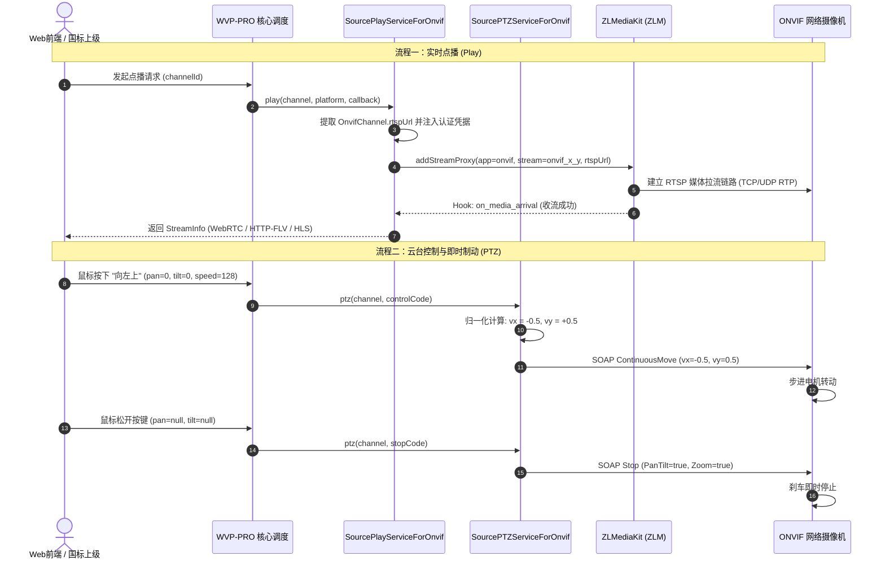

# 第三阶段实施细节：流媒体调度与云台控制策略对接

## 1 阶段概述与架构定位

本阶段实现 ONVIF 码流与 WVP-PRO 核心服务调度框架的深度联动。

依托 WVP-PRO 原生的策略工厂机制（`ChannelDataType`），无需修改 SIP 信令栈的核心路由逻辑，通过向 Spring 容器注册标准策略服务实现：
1. **点播代理调度**：实现 `SourcePlayServiceForOnvifImpl` (`@Service("sourceChannelPlayService4")`)，自动获取 ONVIF 通道 RTSP 地址并在 ZLMediaKit（ZLM）中动态建立拉流代理，经 ZLM 实时转复用为 WebRTC / HTTP-FLV / HLS / RTSP 多协议视频流；
2. **无人观看自动停流**：实现 `SourceOtherServiceForOnvifImpl` (`@Service("sourceChannelOtherService4")`)，监听 ZLM `on_stream_none_reader` Hook 回调，按需自动释放流媒体代理与摄像头编码带宽；
3. **PTZ 坐标归一化与即时制动**：实现 `SourcePTZServiceForOnvifImpl` (`@Service("sourceChannelPTZService4")`)，将国标 $[0, 255]$ 整数速度映射为 ONVIF 标准空间浮点速度 $[-1.0, 1.0]$，实现八向平滑转动、变倍调焦及松手即停（Stop）；
4. **预置位全生命周期管理**：支持预置位的增、删、调用与查询。



---

## 2 流媒体点播调度服务 `SourcePlayServiceForOnvifImpl.java`

在 Spring 容器中注册为服务名 `"sourceChannelPlayService4"`，完整实现 `ISourcePlayService` 契约。

```java
// src/main/java/com/genersoft/iot/vmp/onvif/service/impl/SourcePlayServiceForOnvifImpl.java
package com.genersoft.iot.vmp.onvif.service.impl;

import com.genersoft.iot.vmp.common.StreamInfo;
import com.genersoft.iot.vmp.common.enums.ChannelDataType;
import com.genersoft.iot.vmp.conf.DynamicTask;
import com.genersoft.iot.vmp.conf.UserSetting;
import com.genersoft.iot.vmp.conf.exception.ControllerException;
import com.genersoft.iot.vmp.gb28181.bean.CommonGBChannel;
import com.genersoft.iot.vmp.gb28181.bean.Platform;
import com.genersoft.iot.vmp.gb28181.service.ISourcePlayService;
import com.genersoft.iot.vmp.media.bean.MediaServer;
import com.genersoft.iot.vmp.media.event.hook.Hook;
import com.genersoft.iot.vmp.media.event.hook.HookSubscribe;
import com.genersoft.iot.vmp.media.event.hook.HookType;
import com.genersoft.iot.vmp.media.service.IMediaServerService;
import com.genersoft.iot.vmp.onvif.bean.OnvifChannel;
import com.genersoft.iot.vmp.onvif.bean.OnvifDevice;
import com.genersoft.iot.vmp.onvif.dao.OnvifChannelMapper;
import com.genersoft.iot.vmp.onvif.dao.OnvifDeviceMapper;
import com.genersoft.iot.vmp.service.bean.ErrorCallback;
import com.genersoft.iot.vmp.service.bean.InviteErrorCode;
import com.genersoft.iot.vmp.vmanager.bean.ErrorCode;
import com.genersoft.iot.vmp.vmanager.bean.WVPResult;
import lombok.RequiredArgsConstructor;
import lombok.extern.slf4j.Slf4j;
import org.springframework.stereotype.Service;
import org.springframework.util.StringUtils;

import java.net.URLEncoder;
import java.nio.charset.StandardCharsets;
import java.util.UUID;

/**
 * ONVIF 通道点播拉流调度实现 (实现 ISourcePlayService)
 */
@Slf4j
@Service(ChannelDataType.PLAY_SERVICE + ChannelDataType.ONVIF)
@RequiredArgsConstructor
public class SourcePlayServiceForOnvifImpl implements ISourcePlayService {

    private final OnvifChannelMapper channelMapper;
    private final OnvifDeviceMapper deviceMapper;
    private final IMediaServerService mediaServerService;
    private final HookSubscribe hookSubscribe;
    private final DynamicTask dynamicTask;
    private final UserSetting userSetting;

    @Override
    public void play(CommonGBChannel channel, Platform platform, Boolean record, ErrorCallback<StreamInfo> callback) {
        log.info("[ONVIF-Play] 开始点播通道, dbId: {}, gbId: {}", channel.getDataDeviceId(), channel.getGbDeviceId());

        OnvifChannel onvifChannel = channelMapper.selectById(channel.getDataDeviceId());
        if (onvifChannel == null) {
            callback.run(ErrorCode.ERROR404.getCode(), "ONVIF 通道不存在", null);
            return;
        }

        OnvifDevice device = deviceMapper.selectById(onvifChannel.getDeviceId());
        if (device == null) {
            callback.run(ErrorCode.ERROR404.getCode(), "ONVIF 所属设备不存在", null);
            return;
        }

        String rawRtspUrl = onvifChannel.getRtspUrl();
        if (!StringUtils.hasText(rawRtspUrl)) {
            callback.run(ErrorCode.ERROR100.getCode(), "该通道未解析到有效 RTSP 地址", null);
            return;
        }

        // 1. 构建注入认证信息的 RTSP 地址 (处理特殊字符转义)
        String authRtspUrl = buildAuthenticatedRtspUrl(rawRtspUrl, device.getUsername(), device.getPassword());

        // 2. 选取负载均衡最优的流媒体节点
        MediaServer mediaServer = getMediaServer(device.getMediaServerId());
        if (mediaServer == null) {
            callback.run(ErrorCode.ERROR100.getCode(), "未找到可用的 ZLMediaKit 节点", null);
            return;
        }

        String app = "onvif";
        String stream = String.format("onvif_%d_%d", device.getId(), onvifChannel.getId());

        // 3. 检查流是否已在播放
        StreamInfo existingStream = mediaServerService.getStreamInfoByAppAndStreamWithCheck(app, stream, mediaServer.getId(), null, false);
        if (existingStream != null) {
            log.info("[ONVIF-Play] 流已存在复用播放: app={}, stream={}", app, stream);
            callback.run(ErrorCode.SUCCESS.getCode(), ErrorCode.SUCCESS.getMsg(), existingStream);
            return;
        }

        // 4. 设置收流超时检测任务
        String timeoutTaskKey = UUID.randomUUID().toString();
        Hook rtpArrivalHook = Hook.getInstance(HookType.on_media_arrival, app, stream, mediaServer.getId());

        dynamicTask.startDelay(timeoutTaskKey, () -> {
            log.warn("[ONVIF-Play] 收流超时 ({}s): app={}, stream={}", userSetting.getPlayTimeout(), app, stream);
            hookSubscribe.removeSubscribe(rtpArrivalHook);
            // 超时清理拉流代理
            mediaServerService.delStreamProxy(mediaServer, app, stream);
            callback.run(InviteErrorCode.ERROR_FOR_STREAM_TIMEOUT.getCode(), "ONVIF 摄像头 RTSP 拉流超时", null);
        }, userSetting.getPlayTimeout());

        // 5. 订阅流上线 Hook 事件
        hookSubscribe.addSubscribe(rtpArrivalHook, (hookData) -> {
            log.info("[ONVIF-Play] ZLM 收流成功: app={}, stream={}", hookData.getApp(), hookData.getStream());
            dynamicTask.stop(timeoutTaskKey);
            hookSubscribe.removeSubscribe(rtpArrivalHook);

            StreamInfo streamInfo = mediaServerService.getStreamInfoByAppAndStream(mediaServer, hookData.getApp(), hookData.getStream(), hookData.getMediaInfo(), null);
            callback.run(InviteErrorCode.SUCCESS.getCode(), InviteErrorCode.SUCCESS.getMsg(), streamInfo);
        });

        // 6. 下发 addStreamProxy 命令至 ZLMediaKit
        // rtpType: 0 (TCP/UDP 自适应，优先 TCP 抵抗丢包花屏)
        boolean enableMp4 = (record != null && record);
        WVPResult<String> result = mediaServerService.addStreamProxy(mediaServer, app, stream, authRtspUrl, true, enableMp4, "0", userSetting.getPlayTimeout() * 1000);
        if (result.getCode() != 0) {
            dynamicTask.stop(timeoutTaskKey);
            hookSubscribe.removeSubscribe(rtpArrivalHook);
            log.error("[ONVIF-Play] 调用 ZLM addStreamProxy 失败: {}", result.getMsg());
            callback.run(ErrorCode.ERROR100.getCode(), "调用流媒体节点创建代理失败: " + result.getMsg(), null);
        }
    }

    @Override
    public void stopPlay(CommonGBChannel channel) {
        OnvifChannel onvifChannel = channelMapper.selectById(channel.getDataDeviceId());
        if (onvifChannel == null) return;

        OnvifDevice device = deviceMapper.selectById(onvifChannel.getDeviceId());
        if (device == null) return;

        String app = "onvif";
        String stream = String.format("onvif_%d_%d", device.getId(), onvifChannel.getId());
        MediaServer mediaServer = getMediaServer(device.getMediaServerId());

        if (mediaServer != null) {
            log.info("[ONVIF-Play] 主动停止点播代理: app={}, stream={}", app, stream);
            mediaServerService.delStreamProxy(mediaServer, app, stream);
        }
    }

    @Override
    public void getSnap(CommonGBChannel channel, ErrorCallback<byte[]> callback) {
        // ONVIF 快照抓取能力
        callback.run(ErrorCode.ERROR486.getCode(), "快照请直接访问 snapshot_url", null);
    }

    private MediaServer getMediaServer(String mediaServerId) {
        if (!StringUtils.hasText(mediaServerId) || "auto".equalsIgnoreCase(mediaServerId)) {
            return mediaServerService.getMediaServerForMinimumLoad(null);
        }
        return mediaServerService.getOne(mediaServerId);
    }

    /**
     * 将认证凭证注入到 RTSP URL 中: rtsp://username:password@ip:port/path
     */
    private String buildAuthenticatedRtspUrl(String rtspUrl, String username, String password) {
        if (!StringUtils.hasText(username) || !StringUtils.hasText(password)) {
            return rtspUrl;
        }
        try {
            if (rtspUrl.startsWith("rtsp://")) {
                String sub = rtspUrl.substring(7);
                // 若 URL 中已自带 @ 符号，则直接返回
                if (sub.contains("@")) {
                    return rtspUrl;
                }
                String safeUser = URLEncoder.encode(username, StandardCharsets.UTF_8);
                String safePwd = URLEncoder.encode(password, StandardCharsets.UTF_8);
                return "rtsp://" + safeUser + ":" + safePwd + "@" + sub;
            }
        } catch (Exception e) {
            log.warn("[ONVIF-Play] 构建带认证 RTSP URL 失败: {}", e.getMessage());
        }
        return rtspUrl;
    }
}
```

---

## 3 无人观看自动停流服务 `SourceOtherServiceForOnvifImpl.java`

在 Spring 容器中注册为服务名 `"sourceChannelOtherService4"`，完整实现 `ISourceOtherService` 契约。

```java
// src/main/java/com/genersoft/iot/vmp/onvif/service/impl/SourceOtherServiceForOnvifImpl.java
package com.genersoft.iot.vmp.onvif.service.impl;

import com.genersoft.iot.vmp.common.enums.ChannelDataType;
import com.genersoft.iot.vmp.conf.UserSetting;
import com.genersoft.iot.vmp.gb28181.bean.MobilePosition;
import com.genersoft.iot.vmp.gb28181.service.ISourceOtherService;
import com.genersoft.iot.vmp.media.bean.MediaServer;
import com.genersoft.iot.vmp.media.service.IMediaServerService;
import lombok.RequiredArgsConstructor;
import lombok.extern.slf4j.Slf4j;
import org.springframework.stereotype.Service;

import java.util.List;

/**
 * ONVIF 辅助服务 (无人观看自动停流)
 */
@Slf4j
@Service(ChannelDataType.OTHER_SERVICE + ChannelDataType.ONVIF)
@RequiredArgsConstructor
public class SourceOtherServiceForOnvifImpl implements ISourceOtherService {

    private final UserSetting userSetting;
    private final IMediaServerService mediaServerService;

    @Override
    public Boolean closeStreamOnNoneReader(String mediaServerId, String app, String stream, String schema) {
        // 仅拦截 onvif 应用的流
        if (!"onvif".equals(app)) {
            return null;
        }

        // 检查全局设置是否开启了无人观看按需拉流停流
        if (userSetting.getStreamOnDemand()) {
            log.info("[ONVIF-Stream] 检测到无人观看，触发自动释放拉流代理: app={}, stream={}", app, stream);
            MediaServer mediaServer = mediaServerService.getOne(mediaServerId);
            if (mediaServer != null) {
                mediaServerService.delStreamProxy(mediaServer, app, stream);
            }
            return true;
        }
        return false;
    }

    @Override
    public Boolean addChannelIdForMobilePosition(List<? extends MobilePosition> mobilePositionList) {
        // 固定安装摄像机不支持移动轨迹
        return null;
    }
}
```

---

## 4 云台 PTZ 控制与预置位服务 `SourcePTZServiceForOnvifImpl.java`

在 Spring 容器中注册为服务名 `"sourceChannelPTZService4"`，完整实现 `ISourcePTZService` 契约。

### 4.1 速度归一化数学映射模型

WVP-PRO 统一传入的国标控制参数为：
- 水平控制 `pan`: 0 为左，1 为右，速度 `panSpeed` $\in [0, 255]$；
- 垂直控制 `tilt`: 0 为上，1 为下，速度 `tiltSpeed` $\in [0, 255]$；
- 变倍控制 `zoom`: 0 为缩小，1 为放大，速度 `zoomSpeed` $\in [0, 255]$。

ONVIF 标准空间浮点模型映射公式：
$$v_x = \begin{cases} 
-\frac{V_{\text{pan}}}{255.0} & \text{pan} = 0 \text{ (左)} \\ 
+\frac{V_{\text{pan}}}{255.0} & \text{pan} = 1 \text{ (右)} \\ 
0.0 & \text{pan 为空或未指定}
\end{cases}$$

$$v_y = \begin{cases} 
+\frac{V_{\text{tilt}}}{255.0} & \text{tilt} = 0 \text{ (上)} \\ 
-\frac{V_{\text{tilt}}}{255.0} & \text{tilt} = 1 \text{ (下)} \\ 
0.0 & \text{tilt 为空或未指定}
\end{cases}$$

$$v_z = \begin{cases} 
-\frac{V_{\text{zoom}}}{255.0} & \text{zoom} = 0 \text{ (缩小)} \\ 
+\frac{V_{\text{zoom}}}{255.0} & \text{zoom} = 1 \text{ (放大)} \\ 
0.0 & \text{zoom 为空或未指定}
\end{cases}$$

当 `pan == null && tilt == null && zoom == null` 时，触发带有明确语义的 `ptz:Stop` 报文。

---

### 4.2 核心实现代码

```java
// src/main/java/com/genersoft/iot/vmp/onvif/service/impl/SourcePTZServiceForOnvifImpl.java
package com.genersoft.iot.vmp.onvif.service.impl;

import com.genersoft.iot.vmp.common.enums.ChannelDataType;
import com.genersoft.iot.vmp.gb28181.bean.*;
import com.genersoft.iot.vmp.gb28181.service.ISourcePTZService;
import com.genersoft.iot.vmp.onvif.bean.OnvifChannel;
import com.genersoft.iot.vmp.onvif.bean.OnvifDevice;
import com.genersoft.iot.vmp.onvif.client.OnvifSoapClient;
import com.genersoft.iot.vmp.onvif.client.OnvifXmlBuilder;
import com.genersoft.iot.vmp.onvif.client.OnvifXmlParser;
import com.genersoft.iot.vmp.onvif.dao.OnvifChannelMapper;
import com.genersoft.iot.vmp.onvif.dao.OnvifDeviceMapper;
import com.genersoft.iot.vmp.service.bean.ErrorCallback;
import com.genersoft.iot.vmp.vmanager.bean.ErrorCode;
import lombok.RequiredArgsConstructor;
import lombok.extern.slf4j.Slf4j;
import org.dom4j.Document;
import org.dom4j.DocumentHelper;
import org.dom4j.Element;
import org.springframework.stereotype.Service;
import org.springframework.util.StringUtils;

import java.util.ArrayList;
import java.util.List;

/**
 * ONVIF 云台控制与预置位实现 (实现 ISourcePTZService)
 */
@Slf4j
@Service(ChannelDataType.PTZ_SERVICE + ChannelDataType.ONVIF)
@RequiredArgsConstructor
public class SourcePTZServiceForOnvifImpl implements ISourcePTZService {

    private final OnvifChannelMapper channelMapper;
    private final OnvifDeviceMapper deviceMapper;
    private final OnvifSoapClient soapClient;

    @Override
    public void ptz(CommonGBChannel channel, FrontEndControlCodeForPTZ code, ErrorCallback<String> callback) {
        OnvifChannel onvifChannel = channelMapper.selectById(channel.getDataDeviceId());
        if (onvifChannel == null) {
            callback.run(ErrorCode.ERROR404.getCode(), "ONVIF 通道不存在", null);
            return;
        }

        OnvifDevice device = deviceMapper.selectById(onvifChannel.getDeviceId());
        if (device == null || !StringUtils.hasText(device.getPtzServiceUrl())) {
            callback.run(ErrorCode.ERROR100.getCode(), "该设备不支持 PTZ 云台服务", null);
            return;
        }

        try {
            String ptzUrl = device.getPtzServiceUrl();
            String profileToken = onvifChannel.getProfileToken();

            // 1. 停止判断 (松开按键时下发全空指令)
            if (code.getPan() == null && code.getTilt() == null && code.getZoom() == null) {
                log.info("[ONVIF-PTZ] 下发刹车即时停止: device={}, profile={}", device.getId(), profileToken);
                String stopReq = OnvifXmlBuilder.buildStop(null, profileToken, true, true);
                soapClient.sendAuthenticatedSoap(ptzUrl, null, stopReq, device.getUsername(), device.getPassword(), device.getClockOffset());
                callback.run(ErrorCode.SUCCESS.getCode(), ErrorCode.SUCCESS.getMsg(), null);
                return;
            }

            // 2. 坐标与速度归一化计算
            double vx = 0.0;
            double vy = 0.0;
            double vz = 0.0;

            if (code.getPan() != null) {
                int panSpeed = (code.getPanSpeed() != null && code.getPanSpeed() > 0) ? code.getPanSpeed() : 128;
                double speedNorm = Math.min(1.0, panSpeed / 255.0);
                vx = (code.getPan() == 0) ? -speedNorm : speedNorm; // 0 左, 1 右
            }

            if (code.getTilt() != null) {
                int tiltSpeed = (code.getTiltSpeed() != null && code.getTiltSpeed() > 0) ? code.getTiltSpeed() : 128;
                double speedNorm = Math.min(1.0, tiltSpeed / 255.0);
                vy = (code.getTilt() == 0) ? speedNorm : -speedNorm; // 0 上, 1 下
            }

            if (code.getZoom() != null) {
                int zoomSpeed = (code.getZoomSpeed() != null && code.getZoomSpeed() > 0) ? code.getZoomSpeed() : 128;
                double speedNorm = Math.min(1.0, zoomSpeed / 255.0);
                vz = (code.getZoom() == 0) ? -speedNorm : speedNorm; // 0 缩小, 1 放大
            }

            log.info("[ONVIF-PTZ] 连续转动: vx={}, vy={}, vz={}, device={}, profile={}", vx, vy, vz, device.getId(), profileToken);
            String moveReq = OnvifXmlBuilder.buildContinuousMove(null, profileToken, vx, vy, vz);
            soapClient.sendAuthenticatedSoap(ptzUrl, null, moveReq, device.getUsername(), device.getPassword(), device.getClockOffset());

            callback.run(ErrorCode.SUCCESS.getCode(), ErrorCode.SUCCESS.getMsg(), null);
        } catch (Exception e) {
            log.error("[ONVIF-PTZ] 云台控制指令发送失败: {}", e.getMessage(), e);
            callback.run(ErrorCode.ERROR100.getCode(), "PTZ 控制失败: " + e.getMessage(), null);
        }
    }

    @Override
    public void preset(CommonGBChannel channel, FrontEndControlCodeForPreset code, ErrorCallback<String> callback) {
        OnvifChannel onvifChannel = channelMapper.selectById(channel.getDataDeviceId());
        if (onvifChannel == null) {
            callback.run(ErrorCode.ERROR404.getCode(), "通道不存在", null);
            return;
        }

        OnvifDevice device = deviceMapper.selectById(onvifChannel.getDeviceId());
        if (device == null || !StringUtils.hasText(device.getPtzServiceUrl())) {
            callback.run(ErrorCode.ERROR100.getCode(), "不支持 PTZ", null);
            return;
        }

        try {
            String ptzUrl = device.getPtzServiceUrl();
            String profileToken = onvifChannel.getProfileToken();
            String presetToken = String.valueOf(code.getPresetId());

            if (code.getCode() == 2) {
                // 调用预置位 (GotoPreset)
                log.info("[ONVIF-Preset] 调用预置位: profile={}, presetToken={}", profileToken, presetToken);
                String gotoReq = OnvifXmlBuilder.buildGotoPreset(null, profileToken, presetToken);
                soapClient.sendAuthenticatedSoap(ptzUrl, null, gotoReq, device.getUsername(), device.getPassword(), device.getClockOffset());
                callback.run(ErrorCode.SUCCESS.getCode(), ErrorCode.SUCCESS.getMsg(), null);
            } else if (code.getCode() == 1) {
                // 设置预置位 (SetPreset)
                String setReq = String.format("<tptz:SetPreset><tptz:ProfileToken>%s</tptz:ProfileToken><tptz:PresetName>%s</tptz:PresetName><tptz:PresetToken>%s</tptz:PresetToken></tptz:SetPreset>",
                        profileToken, code.getPresetName() != null ? code.getPresetName() : presetToken, presetToken);
                soapClient.sendAuthenticatedSoap(ptzUrl, null, setReq, device.getUsername(), device.getPassword(), device.getClockOffset());
                callback.run(ErrorCode.SUCCESS.getCode(), ErrorCode.SUCCESS.getMsg(), null);
            } else if (code.getCode() == 3) {
                // 删除预置位 (RemovePreset)
                String delReq = String.format("<tptz:RemovePreset><tptz:ProfileToken>%s</tptz:ProfileToken><tptz:PresetToken>%s</tptz:PresetToken></tptz:RemovePreset>",
                        profileToken, presetToken);
                soapClient.sendAuthenticatedSoap(ptzUrl, null, delReq, device.getUsername(), device.getPassword(), device.getClockOffset());
                callback.run(ErrorCode.SUCCESS.getCode(), ErrorCode.SUCCESS.getMsg(), null);
            } else {
                callback.run(ErrorCode.ERROR100.getCode(), "不支持的预置位指令: " + code.getCode(), null);
            }
        } catch (Exception e) {
            log.error("[ONVIF-Preset] 预置位操作失败: {}", e.getMessage(), e);
            callback.run(ErrorCode.ERROR100.getCode(), "预置位操作失败: " + e.getMessage(), null);
        }
    }

    @Override
    public void queryPreset(CommonGBChannel channel, ErrorCallback<List<Preset>> callback) {
        OnvifChannel onvifChannel = channelMapper.selectById(channel.getDataDeviceId());
        if (onvifChannel == null) {
            callback.run(ErrorCode.ERROR404.getCode(), "通道不存在", null);
            return;
        }

        OnvifDevice device = deviceMapper.selectById(onvifChannel.getDeviceId());
        if (device == null || !StringUtils.hasText(device.getPtzServiceUrl())) {
            callback.run(ErrorCode.SUCCESS.getCode(), "不支持 PTZ", new ArrayList<>());
            return;
        }

        try {
            String ptzUrl = device.getPtzServiceUrl();
            String profileToken = onvifChannel.getProfileToken();
            String getPresetsReq = OnvifXmlBuilder.buildGetPresets(null, profileToken);
            String respXml = soapClient.sendAuthenticatedSoap(ptzUrl, null, getPresetsReq, device.getUsername(), device.getPassword(), device.getClockOffset());

            Document doc = DocumentHelper.parseText(respXml);
            List<Element> presetElements = OnvifXmlParser.findElementsIgnoreCase(doc.getRootElement(), "Preset");

            List<Preset> list = new ArrayList<>();
            for (Element elem : presetElements) {
                String token = elem.attributeValue("token");
                Element nameElem = OnvifXmlParser.findElementIgnoreCase(elem, "Name");
                String name = (nameElem != null) ? nameElem.getTextTrim() : token;

                Preset preset = new Preset();
                preset.setPresetId(token);
                preset.setPresetName(name);
                list.add(preset);
            }
            callback.run(ErrorCode.SUCCESS.getCode(), ErrorCode.SUCCESS.getMsg(), list);
        } catch (Exception e) {
            log.error("[ONVIF-Preset] 查询预置位失败: {}", e.getMessage(), e);
            callback.run(ErrorCode.ERROR100.getCode(), "查询预置位列表失败: " + e.getMessage(), null);
        }
    }

    // 默认空实现或返回不支持的特定硬件接口
    @Override public void fi(CommonGBChannel channel, FrontEndControlCodeForFI code, ErrorCallback<String> cb) { cb.run(ErrorCode.ERROR486.getCode(), "不支持光圈/聚焦控制", null); }
    @Override public void tour(CommonGBChannel channel, FrontEndControlCodeForTour code, ErrorCallback<String> cb) { cb.run(ErrorCode.ERROR486.getCode(), "不支持巡航", null); }
    @Override public void scan(CommonGBChannel channel, FrontEndControlCodeForScan code, ErrorCallback<String> cb) { cb.run(ErrorCode.ERROR486.getCode(), "不支持自动扫描", null); }
    @Override public void auxiliary(CommonGBChannel channel, FrontEndControlCodeForAuxiliary code, ErrorCallback<String> cb) { cb.run(ErrorCode.ERROR486.getCode(), "不支持辅助开关", null); }
    @Override public void wiper(CommonGBChannel channel, FrontEndControlCodeForWiper code, ErrorCallback<String> cb) { cb.run(ErrorCode.ERROR486.getCode(), "不支持雨刷控制", null); }
    @Override public void homePosition(CommonGBChannel channel, Boolean enabled, Integer resetTime, Integer presetIndex, ErrorCallback<String> cb) { cb.run(ErrorCode.ERROR486.getCode(), "不支持看守位", null); }
    @Override public void dragZoom(CommonGBChannel channel, FrontEndControlCodeForDragZoom code, ErrorCallback<String> cb) { cb.run(ErrorCode.ERROR486.getCode(), "不支持拉框放大", null); }
}
```

---

## 5 阶段验收门禁标准

1. **点播全流程闭环**：
   - 触发点播后，后端自动在 ZLM 生成 `app=onvif, stream=onvif_X_Y`；
   - 1.5 秒内出图，WebRTC / HTTP-FLV 播放流畅，音画同步；
2. **无人观看按需停流**：
   - 关闭播放页面后，等待 30 秒（ZLM reader 降为 0），验证 ZLM 代理是否自动被销毁（`delStreamProxy` 调用成功）；
3. **PTZ 响应精度与制动**：
   - 点击前端八向箭头（如“左上”），摄像机平滑转动；
   - 松开鼠标按键后，摄像头在 200ms 内制动刹停，无超调漂移；
4. **预置位查询与跳转**：
   - 能够正常读取摄像机已有的预置位，点击后摄像机准确转向对应预设位置。
